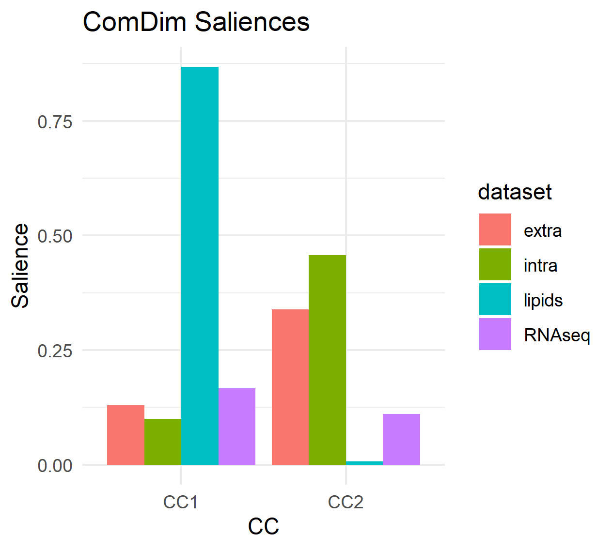
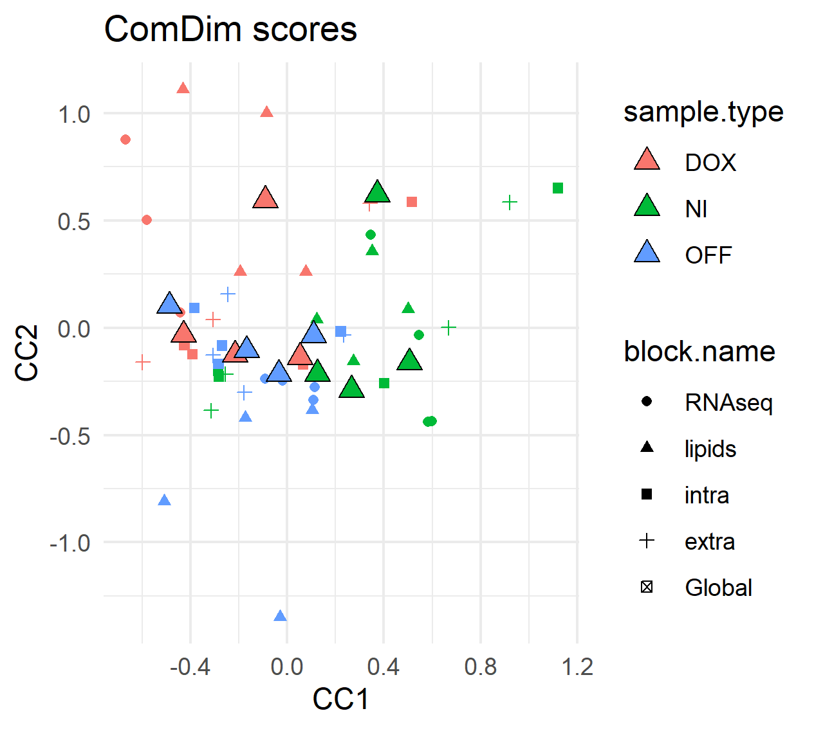

```{r include=FALSE, cache=FALSE}
library(R.ComDim)
knitr::opts_chunk$set(
  fig.align = 'center',
  fig.width = 5,
  fig.height = 5,
  message = FALSE
)
```

```{r, echo = FALSE, eval = FALSE}
library(R.ComDim)
library(tidyverse)
```

# Multi-omics amd Multi-blocks {#multi-omics}

This section will be explained with a multi-omics dataset from an exposition
experiment on normal and tumoral cells. The dataset contains 4 different types 
of data (RNAseq, lipidomics, intracellular and extracellular metabolites).
The studied samples can be classified into 3 groups:

- NI  - non-induced (normal cells)
- DOX - doxycycline induced (tumoral cells),
- OFF - residual cells (treatment-resistant tumoral cells)

More information regarding the experimental protocol can be consulted [**here**](https://doi.org/10.15252/msb.202010141). The metabolomics data was
downloaded from Metabolights
 [**MTBLS1507**](https://www.ebi.ac.uk/metabolights/MTBLS1507)
while the RNAseq data was obtained from ARRAYEXPRESS [**E-MTAB-8834**](https://www.ebi.ac.uk/arrayexpress/experiments/E-MTAB-8834/).

```{r multiomics, echo = TRUE, eval = FALSE}
data(mouse_ds)

allMB <- BuildMultiBlock(t(RNAseq3[,1:12]), t(lipids), t(intra), t(extra))
allMB <- setBlockNames(allMB, c('RNAseq', 'lipids','intra','extra'))
```


## Data processing {#PART1}

This is an example of a possible data processing:

```{r multiomics-preprocess, echo = TRUE, eval = FALSE}
# 1) Exclude normalized variables with max intensity reported below 0.1% of the
#    max from all RNAseq blocks.
allMB <- ProcessMultiBlock(
  allMB,
  blocks = 'RNAseq',
  FUN.SelectVars = function(x) {apply(x,2,max) > max(x, na.rm = TRUE) * 0.001})
allMB <- NARemoveMultiBlock(allMB, blocks = 'RNAseq',
                             method = 'fixed.value.all', constant = 1)

# 2) Do rlog transform of the RNAseq data (rlog assumes samples in columns)
#    The rlog transform function is obtained from the DESeq2 R-package.
library(DESeq2)
allMB <- ProcessMultiBlock(allMB, blocks = 'RNAseq',
                            FUN = function(x){t(DESeq2::rlog(t(x)))})
# 3) Replace NAs by random noise
allMB <- NARemoveMultiBlock(allMB, method = 'random.noise')

# 4) Normalize (mean-center and divided by each block-norm)
allMB <- NormalizeMultiBlock(allMB, method = 'norm')
```


## Data analysis {#PART2}

We use in this example ComDim-PCA, which is intended for exploratory purposes.
The ComDim analysis is run with 2 components.
```{r multiomics-analysis, echo = TRUE, eval = FALSE}
resultsPCA <- ComDim_PCA_MB(allMB, ndim = 2) # 2 Components.
```

`resultsPCA` is an object of class `ComDim`.
Let's proceed now to inspect some of the results from this analysis.


### Saliences

We can start by looking at the saliences, which show the contribution of each 
block for every component.
```{r multiomics-saliences, echo = TRUE, eval = FALSE}
saliences <- resultsPCA@Saliences %>%
  as.data.frame() %>%
  mutate(dataset = rownames(.)) %>%
  pivot_longer(cols = c('CC1','CC2'),
               names_to = 'CC',
               values_to = 'Salience')

saliences # The salience values.

ggplot(data = saliences,
       aes(x = CC, y = Salience, group = dataset )) +
  geom_bar(stat = 'identity', position = 'dodge',
           aes(fill = dataset)) +
  theme_minimal() +
  labs(title = 'ComDim Saliences')

```

```{r, echo=FALSE, out.width="50%", fig.align = 'center', fig.cap="Saliences"}

```

### Scores

The scores give the contribution of each sample. There are two types of scores,
**Global** (Q.scores) and **Local** (T.scores). **Global scores** show the 
contribution for the total model (all blocks) while the **Local scores** give 
the contribution for each of the blocks.
```{r multiomics-scores, echo = TRUE, eval = FALSE}
scoresTable <- MakeComDimScoresTable(model = resultsPCA)

head(scoresTable) # The 6 first rows of the scores table

scoresTable_wider <- scoresTable %>%
  mutate(sample.type = case_when(grepl('DOX', sample.id) ~ 'DOX',
                                 grepl('NI', sample.id) ~ 'NI',
                                 grepl('OFF', sample.id) ~ 'OFF')) %>%
  dplyr::select(sample.id, sample.type, block.name, scores.type.dim, value) %>%
  dplyr::group_by(sample.id, sample.type, scores.type.dim, block.name) %>%
  pivot_wider(names_from = scores.type.dim, values_from = value)

ggplot(data = scoresTable_wider) +
  geom_point(aes(x = T.scores1, y = T.scores2, color = sample.type,
                 shape = block.name)) +
  geom_point(aes(x = Q.scores1, y = Q.scores2,
                 fill = sample.type, shape = block.name),
             size = 3, shape = 24, color = 'black') +
  theme_minimal() +
  labs(title = 'ComDim scores', x = 'CC1', y = 'CC2')
  # OFF samples are very different than DOX and NI by their lipid content.
  # Extracellular metabolites are not very different

```
```{r, echo=FALSE, out.width="50%", fig.align = 'center', fig.cap="Scores"}

```

### Loadings

The **loadings** give the contribution of each variable in the model.
And example of how to use the loadings is presented in [**CHAPTER6**](https://f-puig.github.io/R.ComDim.Docs/Section5.html).


## Data prediction {#PART3}

The built model can be used to investigate new samples if available.
```{r multiomics-predict, echo = TRUE, eval = FALSE}
pred.resultsPCA <- Predict_MB(MB = allMB, model = resultsPCA)
data.frame(original = resultsPCA@T.scores[[2]][,1],
           predicted = pred.resultsPCA@T.scores[[2]][,1])
data.frame(original = resultsPCA@Q.scores[,2],
           predicted = resultsPCA@Q.scores[,2])
```
In this example, the original and predicted scores are identical because the
new samples are the same as the original ones.
