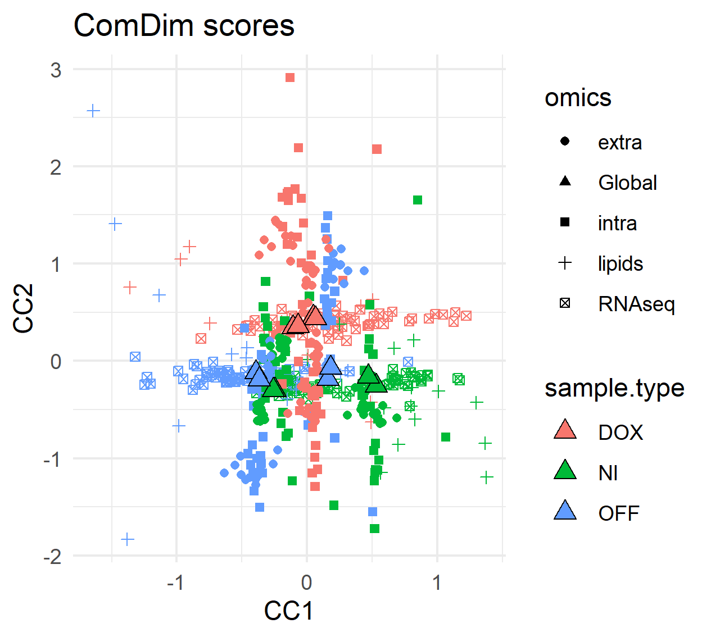
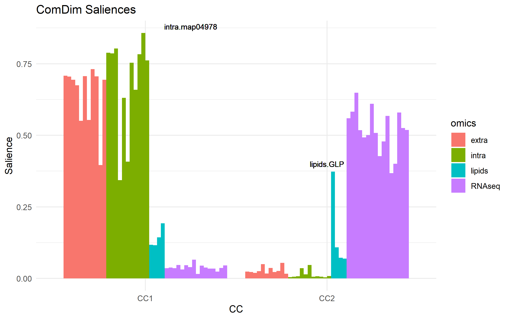
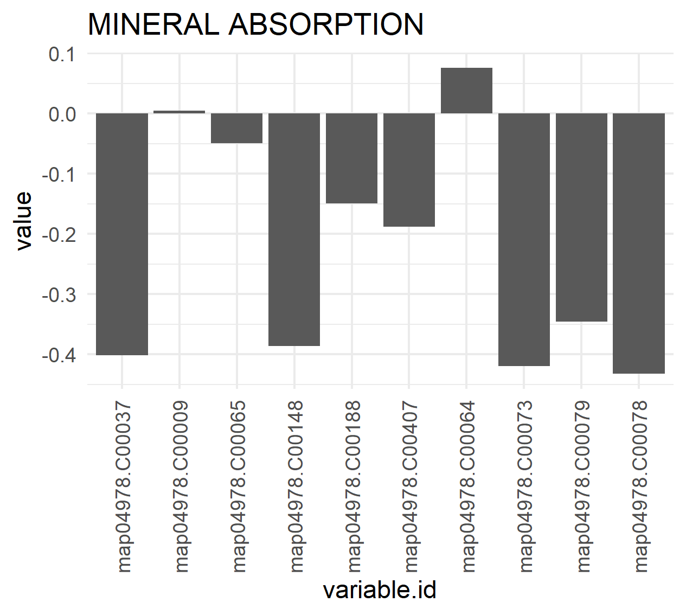
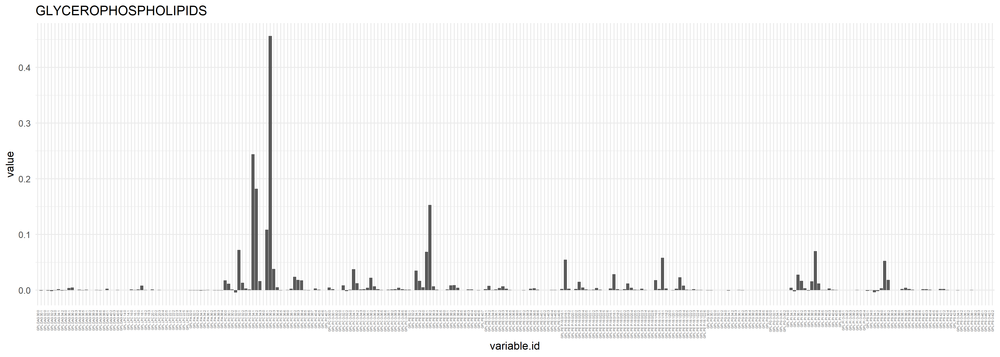
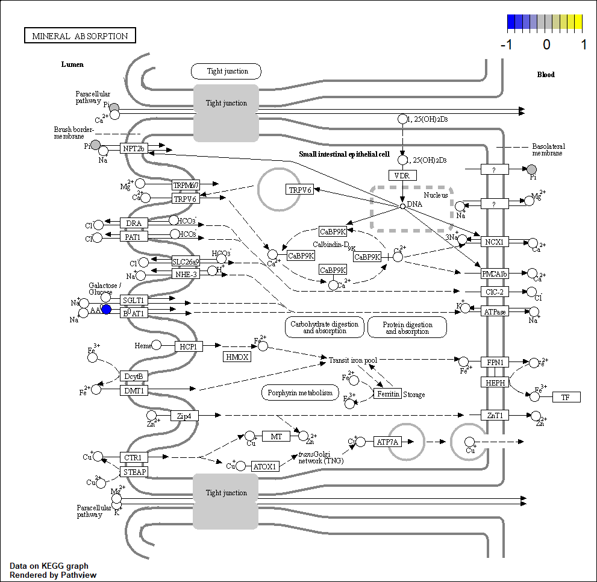
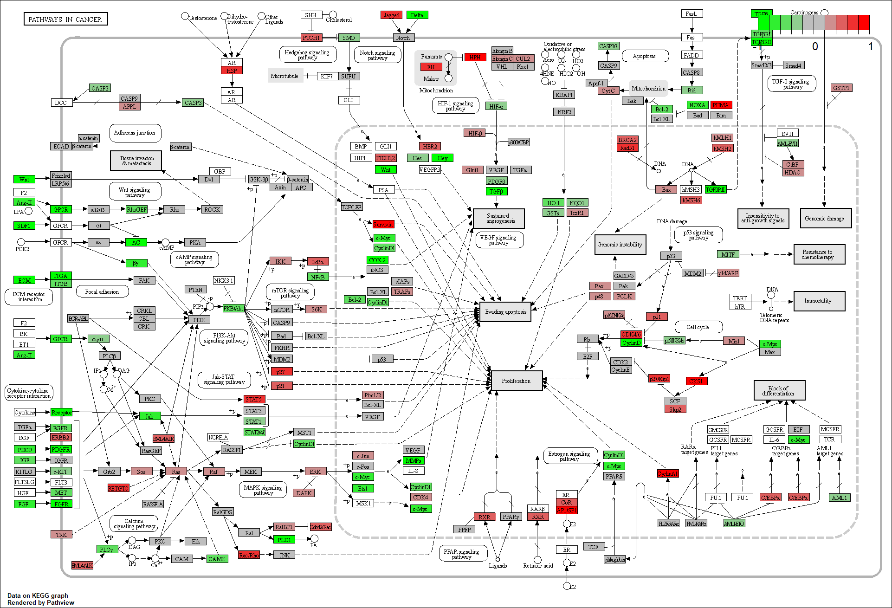

```{r include=FALSE, cache=FALSE}
library(R.ComDim)
knitr::opts_chunk$set(
  fig.align = 'center',
  fig.width = 5,
  fig.height = 5,
  message = FALSE
)
```

```{r, echo = FALSE, eval = FALSE}
library(R.ComDim)
library(tidyverse)
```

# Data from a single omics data are multi-blocks {#Section5}

Metabolic pathways are composed by a group of related metabolites. Extrapolating
 this concept into the MultiBlock domain, it is possible to convert a 
 **metabolomics dataset** into a `MultiBlock`, where each of the blocks will be 
 characteristic of one **metabolic pathway**.
 
 This strategy can be applied to other types of omics datasets. For example,
 **transcriptomics datasets** can be transformed to `MultiBlocks` by the 
 **Gene Ontology** information, and **phylogenetic data** can be split according
 to any of the **taxonomic levels** (class, family, gender, species,...).

 In the `R.ComDim` package, this data transformation can be mediated with the 
 `ExpandMultiBlock()` function and a reference metadata file with the list of
 categories each variable can be listed in. In the resulting `MultiBlock`, a 
 variable will be included in as many blocks as groups (i.e. molecular function)
 it belongs to.

```{r Expand, echo = TRUE, eval = FALSE}
data(mouse_ds)
lipidsMB <- ExpandMultiBlock(data = lipids, metadata = metadata_lipids,
                             minblock = 0, loquace = FALSE)
extraMB <- ExpandMultiBlock(data = extra, metadata = KEGG_table_metabolites,
                            minblock = 10, loquace = FALSE)
intraMB <- ExpandMultiBlock(data = intra, metadata = KEGG_table_metabolites,
                            minblock = 10, loquace = FALSE)
RNAseqMB <- ExpandMultiBlock(data = RNAseq3[,1:12],
                             metadata = metadata_RNAseq3,
                             minblock = 500, loquace = FALSE)
# We can count the number of blocks in each MultiBlock
length(getBlockNames(lipidsMB)) # 4 blocks
length(getBlockNames(extraMB))  # 12 blocks
length(getBlockNames(intraMB))  # 12 blocks
length(getBlockNames(RNAseqMB)) # 16 blocks
```

Since the blocks from this `MultiBlock` are related to a specific biological 
role, the **ComDim analysis** can be used to determine the biological roles more
important in the the studied dataset.

In the `MultiBlock`s above, we only kept those blocks containing equal or more 
than `minblock` variables (i.e. only the RNAseq-related blocks containing 500 or
more variables were kept).
In order to find the most relevant pathways, ComDim will consider all blocks 
equally important, causing that the variables from the smallest blocks will 
contribute more to the final model than the variables from the largest blocks. 
Then, the `minblock` filter is applied to avoid that the smallest blocks
(which usually relate to poorly-characterized biological roles, and thus hardly 
interpretable) influence the ComDim model construction.

Let's continue with the example from before, but before the ComDim analysis we
can apply some data transformations.

```{r block-labels, echo = TRUE, eval = FALSE}
# Blocks are relabelled for clarity
lipidsMB <- setBlockNames(lipidsMB,
                          paste("lipids", getBlockNames(lipidsMB), sep = '.'))
intraMB <- setBlockNames(intraMB,
                         paste("intra", getBlockNames(intraMB), sep = '.'))
extraMB <- setBlockNames(extraMB,
                         paste("extra", getBlockNames(extraMB), sep = '.'))
RNAseqMB <- setBlockNames(RNAseqMB,
                          paste("RNAseq", getBlockNames(RNAseqMB), sep = '.'))

allMB2 <- BuildMultiBlock(RNAseqMB, lipidsMB, intraMB, extraMB)
```
Now, all 4 `MultiBlock`s were merged into a single `MultiBlock`, and each block
contains a suffix denoting the omics data type.

We apply some data pre-processings:
```{r preprocess, echo = TRUE, eval = FALSE}
# We apply some pre-processings
  library(DESeq2)
  # Remove blocks relative to map01100
  # (not very informative, it's the map with all metabolic pathways)
  allMB2 <- ProcessMultiBlock(allMB2,
    blocks = which(grepl('map01100', getBlockNames(allMB2))),
    # All blocks with map01100 are deleted, since ncol(x) is always > 0.
    FUN.SelectBlocks = function(x){ncol(x) < 0})
  # Calculate the absolute maximum from the RNAseq data.
  maxMB <- max(MultiBlock2matrix(allMB2,
                                 blocks = grep('RNAseq',getBlockNames(allMB2))
                                 ),
               na.rm = TRUE)
  # Exclude normalized variables with max intensity reported below 0.1%
  # of the max from all RNAseq blocks.
  allMB2 <- ProcessMultiBlock(allMB2,
     blocks = grep('RNAseq',getBlockNames(allMB2)),
     FUN.SelectVars = function(x) {apply(x,2,max) > maxMB * 0.001})
  # Add 1 to each value in RNAseq data to remove 0s.
  allMB2 <- NARemoveMultiBlock(allMB2,
     blocks = grep('RNAseq',getBlockNames(allMB2)),
     method = 'fixed.value.all',
     constant = 1)
  # Do rlog transform of the RNAseq data.
  allMB2 <- ProcessMultiBlock(allMB2,
     blocks = grep('RNAseq',getBlockNames(allMB2)),
     # Normalize rlog transcript counts
     FUN = function(x){t(DESeq2::rlog(t(x)))})
  # Replace NAs by random noise
  allMB2 <- NARemoveMultiBlock(allMB2, method = 'random.noise')
  # Normalize (mean-center and divided by each block-norm)
  allMB2 <- NormalizeMultiBlock(allMB2, method = 'norm')
```

We continue with the ComDim analysis:
```{r ComDim, echo = TRUE, eval = FALSE}
  resultsPCA2 <- ComDim_PCA_MB(allMB2, ndim = 2)
```

A first look at the scores can tell us how the blocks relate to the sample type. 

```{r ComDim-scores, echo = TRUE, eval = FALSE}
  scoresTable <- MakeComDimScoresTable(model = resultsPCA2)
  scoresTable_wider <- scoresTable %>%
    mutate(sample.type = case_when(grepl('DOX', sample.id) ~ 'DOX',
                                   grepl('NI', sample.id) ~ 'NI',
                                   grepl('OFF', sample.id) ~ 'OFF')) %>%
    dplyr::select(sample.id, sample.type, block.name, scores.type.dim, value) %>%
    dplyr::group_by(sample.id, sample.type, scores.type.dim, block.name) %>%
    pivot_wider(names_from = scores.type.dim, values_from = value) %>%
    mutate(omics = case_when(grepl('RNAseq', block.name) ~ 'RNAseq',
                             grepl('lipids', block.name) ~ 'lipids',
                             grepl('extra', block.name) ~ 'extra',
                             grepl('intra', block.name) ~ 'intra',
                             grepl('Global', block.name) ~ 'Global'))

  ggplot(data = scoresTable_wider) +
    geom_point(aes(x = T.scores1, y = T.scores2, color = sample.type, shape = omics)) +
    geom_point(aes(x = Q.scores1, y = Q.scores2, fill = sample.type),
               size = 3, shape = 24, color = 'black') +
    theme_minimal() +
    labs(title = 'ComDim scores', x = 'CC1', y = 'CC2')
```
```{r, echo=FALSE, out.width="50%", fig.align = 'center', fig.cap="Scores"}

```

The metabolomic and the RNAseq profiles appear to be very orthogonal
(uncorrelated), since intra and extra does not change much (within each group) 
in CC2 whereas the RNAseq does not change much in CC1.
For RNAseq molecular functions, CC1 separates OFF from NI and DOX.
CC2 separates DOX from NI and OFF.
Despite this, NI seems to be different from DOX and OFF at the lipidomic level.


## Molecular functions {#molecular-functions}

Let's start by looking at the **saliences**:
```{r ComDim-saliences, echo = TRUE, eval = FALSE}
# Plot saliences
saliences2 <- resultsPCA2@Saliences %>%
  as.data.frame() %>%
  mutate(dataset = rownames(.)) %>%
  pivot_longer(cols = c('CC1','CC2'),
               names_to = 'CC',
               values_to = 'Salience') %>%
  mutate(omics = case_when(grepl('RNAseq', dataset) ~ 'RNAseq',
                           grepl('lipids', dataset) ~ 'lipids',
                           grepl('extra', dataset) ~ 'extra',
                           grepl('intra', dataset) ~ 'intra'))
  ggplot(data = saliences2,
       aes(x = CC, y = Salience, group = dataset )) +
  geom_bar(stat = 'identity', position = 'dodge',
           aes(fill = omics)) +
  theme_minimal() +
  geom_text(label = 'lipids.GLP', x = 2, y = 0.4, size = 3) +
  geom_text(label = 'intra.map04978', x = 1.25, y = 0.88, size = 3) +
  labs(title = 'ComDim Saliences')
```

CC1 is descriptive of metabolomics data (both intra and extra)
CC2 is descriptive of RNAseq and glycerophospholipids (lipids.GLP)
The most altered molecular function is map04978 (mineral absorption),
in the "intra" data.

### The molecular patwhays

By inspecting the loadings, we can have an idea of the most altered omics
features in the block.
We will plot now the loadings for the two most relevant blocks as seen in the
previous section.
```{r ComDim-loadings, echo = TRUE, eval = FALSE}
  # MINERAL ABSORPTION
  LoadingsTable <- MakeComDimLoadingsTable(model = resultsPCA2,
                                           block = 'intra.map04978',
                                           dim = 1)
  ggplot(LoadingsTable, aes(x = variable.id, y = value)) +
    geom_bar(stat = 'identity') +
    labs(title = 'MINERAL ABSORPTION') +
    theme_minimal() +
    theme(axis.text.x = element_text(angle = 90, vjust = 0.5, hjust=1))

  # GLYCEROPHOSPHOLIPIDS
  LoadingsTable <- MakeComDimLoadingsTable(model = resultsPCA2,
                                           block = 'lipids.GPL',
                                           dim = 2)
  ggplot(LoadingsTable, aes(x = variable.id, y = value)) +
    geom_bar(stat = 'identity') +
        labs(title = 'GLYCEROPHOSPHOLIPIDS') +
    theme_minimal() +
    theme(axis.text.x = element_text(angle = 90, vjust = 0.5, hjust=1,
                                     size = 3))
```

```{r, echo=FALSE, out.width="50%", fig.align = 'center', fig.cap="Mineral absorption"}

```


Most important changes in the GPL group occur for PC36:2, PC34:1, PC:34:2, 
PE36:2, PC36:1,...


We can also plot the loadings into **KEGG pathway maps** (if the omics variables
can be matched with the KEGG identifiers).

Here is an example for the metabolomics data:
```{r ComDim-loadings2, echo = TRUE, eval = FALSE}
# MINERAL ABSORPTION
# Prepare input data
loadingVector <- LoadingsTable$value * 10 # 10 is a factor used to maximize
                                          # the color contrast in the resulting
                                          # KEGG map.
names(loadingVector) <- gsub("map04978.","",LoadingsTable$variable.id)

library(pathview) # From Bioconductor
pv.out <- pathview(cpd.data = loadingVector,
                   pathway.id = "04978",
                   species = "mmu",
                   out.suffix = "ComDim")
```
The map is saved in the working directory:



And here, there is an example for the RNAseq-data (block mmu05200, "Pathways in 
Cancer"):
```{r ComDim-loadings3, echo = TRUE, eval = FALSE}
LoadingsTable <- MakeComDimLoadingsTable(model = resultsPCA2,
                                           block = 'RNAseq.mmu05200',
                                           dim = 2)
# Prepare input data
loadingVector <- LoadingsTable$value * 10 # 10 is a factor to maximize 
                                          # the color contrast in the
                                          # resulting KEGG map.
names(loadingVector) <- gsub("mmu05200.","",LoadingsTable$variable.id)

library(pathview) # From Bioconductor
pv.out <- pathview(gene.data = loadingVector,
                   pathway.id = "05200",
                   species = "mmu",
                   out.suffix = "ComDim")
```

