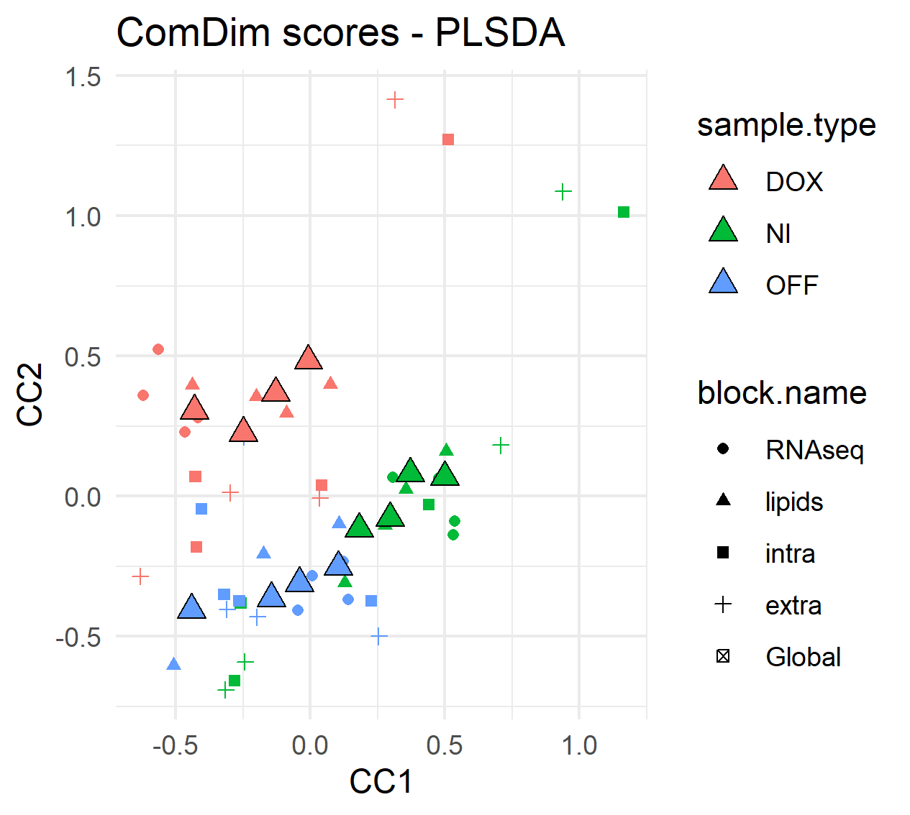

```{r include=FALSE, cache=FALSE}
library(R.ComDim)
knitr::opts_chunk$set(
  fig.align = 'center',
  fig.width = 5,
  fig.height = 5,
  message = FALSE
)
```

```{r, echo = FALSE, eval = FALSE}
library(R.ComDim)
library(tidyverse)
data(mouse_ds)
allMB <- BuildMultiBlock(t(RNAseq3[,1:12]), t(lipids), t(intra), t(extra))
allMB <- setBlockNames(allMB, c('RNAseq', 'lipids','intra','extra'))
# Exclude normalized variables with max intensity reported below 0.1%
# of the max from all RNAseq blocks.
allMB <- ProcessMultiBlock(allMB,
                            blocks = 'RNAseq',
                            FUN.SelectVars = function(x) {apply(x,2,max) > max(x, na.rm = TRUE) * 0.001})
allMB <- NARemoveMultiBlock(allMB, blocks = 'RNAseq',
                             method = 'fixed.value.all', constant = 1)
# Do rlog transform of the RNAseq data (rlog assumes samples in columns)
allMB <- ProcessMultiBlock(allMB, blocks = 'RNAseq',
                            FUN = function(x){t(DESeq2::rlog(t(x)))})
# Replace NAs by random noise
allMB <- NARemoveMultiBlock(allMB, method = 'random.noise')
# Normalize (mean-center and divided by each block-norm)
allMB <- NormalizeMultiBlock(allMB, method = 'norm')
```

# Data from a single omics data are multi-blocks {#Section6}

In the previous sections, we have only used **ComDim-PCA**, but many other
ComDim versions exist. ComDim can be regarded as a chemometric method able to
compact the relevant information of the data into a reduced subspace, defined by
the **scores**, the **loadings** and the **saliences**.
Although most ComDim analyses employ **Principal Component Analysis (PCA)** as 
the core method to find this reduced space, other approaches can be used.

The `R.Comdim` package includes a few of those other methods, as well as some
additional functions **to allow the users to create their own ComDim methods**.

## ComDim-Partial Least Squares (ComDim-PLS) {#PLS}
```{r PLS, echo = TRUE, eval = FALSE}
resultsPLSR <- ComDim_PLS_MB(allMB,
                             y= c(rep(1,4),rep(5,4),rep(10,4)),
                             # Arbitrary scale, just for the demonstration
                             ndim = 2, method = 'PLS-R')
```


## ComDim-Partial Least Squares Discriminant Analysis (ComDim-PLSDA) {#PLS-DA}
```{r PLSDA, echo = TRUE, eval = FALSE}
resultsPLSDA <- ComDim_PLS_MB(allMB,
                              y= c(rep('NI',4),rep('DOX',4),rep('OFF',4)),
                              ndim = 2, method = 'PLS-DA')

# Method evaluation
resultsPLSDA@R2X
resultsPLSDA@R2Y
resultsPLSDA@Q2
resultsPLSDA@Prediction$confusionMatrix

# Plot saliences
saliencesPLSDA <- resultsPLSDA@Saliences %>%
  as.data.frame() %>%
  mutate(dataset = rownames(.)) %>%
  pivot_longer(cols = c('CC1','CC2'),
               names_to = 'CC',
               values_to = 'Salience')

ggplot(data = saliencesPLSDA,
       aes(x = CC, y = Salience, group = dataset )) +
  geom_bar(stat = 'identity', position = 'dodge',
           aes(fill = dataset)) +
  theme_minimal() +
  labs(title = 'ComDim Saliences')

# Plot scores
scoresTable <- MakeComDimScoresTable(model = resultsPLSDA)
scoresTable_wider <- scoresTable %>%
  mutate(sample.type = case_when(grepl('DOX', sample.id) ~ 'DOX',
                                 grepl('NI', sample.id) ~ 'NI',
                                 grepl('OFF', sample.id) ~ 'OFF')) %>%
  dplyr::select(sample.id, sample.type, block.name, scores.type.dim, value) %>%
  dplyr::group_by(sample.id, sample.type, scores.type.dim, block.name) %>%
  pivot_wider(names_from = scores.type.dim, values_from = value)

ggplot(data = scoresTable_wider) +
  geom_point(aes(x = T.scores1, y = T.scores2,
                 color = sample.type, shape = block.name)) +
  geom_point(aes(x = Q.scores1, y = Q.scores2,
                 fill = sample.type, shape = block.name),
             size = 3, shape = 24, color = 'black') +
  theme_minimal() +
  labs(title = 'ComDim scores - PLSDA', x = 'CC1', y = 'CC2')
```



## ComDim-kernel-OPLS {#KOPLS}
```{r kOPLS, echo = TRUE, eval = FALSE}
source('./R/ComDim_KOPLS_MB.R')
resultsKOPLSDA <- ComDim_KOPLS_MB(allMB, y= c(rep('NI',4),rep('DOX',4),rep('OFF',4)),
                                  max.ort = 2, method = 'k-OPLS-DA', nrcv = 5)
```


## Other extensions {#Other}

The functions `ComDim_Exploratory_MB()` and `ComDim_y_MB()` can be employed to 
use customized versions of Com-Dim for exploratory and regression/discriminant 
purposes. In both functions, the parameter `FUN` allows the user to run ComDim
with their chemometric method of preference.

### Example of ComDim-ICA

The function used to execute **Independent Component Analysis (ICA)** was 
`ica()` from the `ica` package.
In order to make the `ComDim_Exploratory_MB()` function to understand the output
of `ica()`, we embedded it into another function that returns the source 
estimates (representative of the samples information, analogous to the PCA 
scores) named `fun.ICA`.
```{r ica, echo = TRUE, eval = FALSE}
library(ica)

fun.ICA <- function(W, ndim,...){
  # W is the concatenated MB.
  # ndim is the number of components.
  # X and nc are the arguments of ica::ica.
  result <- ica::ica(W, ndim)
  sources <- result$S
  # The function must return the source estimates
  # The analogue to the PCA scores for ICA.
  return(sources)
}
resultsICA <- ComDim_Exploratory_MB(allMB, ndim = 2,
                                    FUN = fun.ICA,
                                    method = 'ICA')
```

### Example of ComDim-PLS (version ropls)

The function used to execute **PLS** here was `opls()`, obtained from the
`ropls` package.
In this case, `fun.PLS` is used to capture the output from the PLS analysis
(scores,P,W,U,Q,y).
```{r ropls1, echo = TRUE, eval = FALSE}
library(ropls) # From bioconductor
source('./R/ComDim_y_MB.R')
fun.PLS <- function(W, y, ndim,...){
  # W is the concatenated MB.
  # ndim is the number of components.
  # X and nc are the arguments of ica::ica.
  output <- list()
  result <- ropls::opls(x = W, y = y, predI = ndim,
                        fig.pdfC = 'none',
                        info.txtC = 'none')
  # The returning object must be a list containing the following 6 elements:
  output$scores <- result@scoreMN[,1]
  output$P <- result@loadingMN[,1]
  output$W <- result@weightMN[,1]
  output$U <- result@uMN[,1]
  output$Q <- result@cMN[,1]
  output$y <- result@suppLs$yModelMN # To evaluate if y is transformed within opls. (it is!)
  return(output)
}
resultsPLS <- ComDim_y_MB(allMB,
                          y =c(rep(1,4),rep(5,4),rep(10,4)),
                          ndim = 2,
                          type = 'regression',
                          orthogonalization = FALSE,
                          FUN = fun.PLS,
                          method = 'PLS(ropls)')
```


### Example of ComDim-PLSDA (version ropls)

For ComDim-PLS-DA, we can use the same function `fun.PLS` as before, but we need
to specify that the `type` of the method is `'discriminant'` and we need to
provide the sample classes in `y`:
```{r ropls2, echo = TRUE, eval = FALSE}
resultsPLSDA <- ComDim_y_MB(allMB,
                           y =c(rep('NI',4),rep('DOX',4),rep('OFF',4)),
                           ndim = 2,
                           type = 'discriminant',
                           orthogonalization = FALSE,
                           FUN = fun.PLS,
                           method = 'PLSDA(ropls)')
```


### Example of ComDim-OPLSDA (version ropls)

For ComDim-OPLSDA, the function in `FUN` needs to capture additional outputs 
related to the orthogonal components. See the example below:
```{r ropls3, echo = TRUE, eval = FALSE}
# We will apply ComDim-OPLSDA on a subset with 2 classes only.
allMB_small <- FilterSamples_MB(allMB,
                                getSampleNames(allMB)[c(1:4,9:12)])
fun.OPLSDA <- function(W, y, ndim,...){
  # W is the concatenated MB.
  # ndim is the number of components.
  output <- list()
  Y <- c(-1,1)[apply(y, 1, function(x) match(1,x))]
  # Y must be a vector for ropls
  result <- ropls::opls(x = W, y = Y,
                        predI = 1,
                        orthoI = NA, # The number of orthogonal components
                                     # is optimized for every block.
                        fig.pdfC = 'none',
                        info.txtC = 'none')
  # The returning object must be a list containing the following 9 elements:
  output$scores <- result@scoreMN[,1]
  output$P <- result@loadingMN[,1]
  output$W <- result@weightMN[,1]
  output$U <- result@uMN[,1]
  output$Q <- result@cMN[,1]
  output$Q <- c(-output$Q,output$Q)
  # Y has two columns (one per class): -1 and 1.
  output$y <- result@suppLs$yModelMN
  # To evaluate if y is transformed within opls. (it is!)
  output$orthoscores <- result@orthoScoreMN
  output$orthoP <- result@orthoLoadingMN
  output$ort <- result@summaryDF$ort # Number of orthogonal components
  return(output)
}
resultsOPLSDA <- ComDim_y_MB(allMB_small,
                            y =c(rep('NI',4),rep('OFF',4)),
                            ndim = 1,
                            type = 'discriminant',
                            orthogonalization = TRUE,
                            FUN = fun.OPLSDA,
                            method = 'OPLSDA(ropls)')
```
