```{r include=FALSE, cache=FALSE}
library(R.ComDim)
knitr::opts_chunk$set(
  fig.align = 'center',
  fig.width = 5,
  fig.height = 5,
  message = FALSE
)
```

```{r, echo = FALSE, eval = TRUE}
library(R.ComDim)
library(tidyverse)
data(mouse_ds)
allMB <- MultiBlock(Data = list(b1 = RNAseq3,
                                b2 = lipids,
                                b3 = intra,
                                b4 = extra))
blockNames(allMB) <- c('RNAseq', 'lipids', 'intra', 'extra')
# Exclude normalized variables with max intensity reported below 0.1%
# of the max from all RNAseq blocks.
allMB <- ProcessMultiBlock(allMB,
                            blocks = 'RNAseq',
                            FUN.SelectVars = function(x) {apply(x,2,max) > max(x, na.rm = TRUE) * 0.001})
allMB <- NAInfRemoveMultiBlock(allMB, blocks = 'RNAseq',
                               na.method = 'fixed.value.all', constant = 1)
# Do rlog transform of the RNAseq data (rlog assumes samples in columns)
allMB <- ProcessMultiBlock(allMB, blocks = 'RNAseq',
                            FUN = function(x){t(DESeq2::rlog(t(x)))})
# Replace NAs by random noise
allMB <- NAInfRemoveMultiBlock(allMB, na.method = 'random.noise')
# Normalize (mean-center and divided by each block-norm)
allMB <- NormalizeMultiBlock(allMB, method = 'norm')
```

# Other ComDim methods {#Section6}

In the previous sections, we have only used **ComDim-PCA**, but many other
ComDim versions exist. ComDim can be regarded as a chemometric method able to
compact the relevant information of the data into a reduced subspace, defined by
the **scores**, the **loadings** and the **saliences**.
Although most ComDim analyses employ **Principal Component Analysis (PCA)** as
the core method to find this reduced space, other approaches can be used.

The `R.ComDim` package includes a few of those other methods, as well as some
additional functions **to allow the users to create their own ComDim methods**.

## ComDim-Partial Least Squares Discriminant Analysis (ComDim-PLSDA) {#PLS-DA}

**ComDim-PLSDA** is executed with the function `ComDim_PLS()`, by
providing a `y` vector with the sample class labels and setting
`method = 'PLS-DA'`.
The output object contains the typical PLS figures of merit
(**R2X**, **R2Y**, **Q2**, **DQ2**), the **VIP** (Variable Importance in
Projection) scores per variable and per block, the PLS regression coefficients
**B** and **B0**, and the **predicted class** assignments along with a
**confusion matrix**, **sensitivity** and **specificity** per class.

```{r PLSDA, echo = TRUE, eval = TRUE}
resultsPLSDA <- ComDim_PLS(allMB,
                              y = c(rep('NI',4), rep('DOX',4), rep('OFF',4)),
                              ndim = 2, method = 'PLS-DA')

# Figures of merit
resultsPLSDA@R2X
resultsPLSDA@R2Y
resultsPLSDA@Q2   # Cross-validated Q2 per class
resultsPLSDA@DQ2  # Cross-validated discriminant Q2 per class
# The model results to predict all the classes

# Classification outputs
resultsPLSDA@Prediction$confusionMatrix
resultsPLSDA@Prediction$Sensitivity
resultsPLSDA@Prediction$Specificity

# VIP scores (Variable Importance in Projection)
head(resultsPLSDA@VIP.block[["RNAseq"]])
```

```{r PLSDA-plots, echo = TRUE, eval = FALSE}
# Plot saliences
saliencesPLSDA <- resultsPLSDA@Saliences %>%
  as.data.frame() %>%
  mutate(dataset = rownames(.)) %>%
  pivot_longer(cols = c('CC1','CC2'),
               names_to = 'CC',
               values_to = 'Salience')

ggplot(data = saliencesPLSDA,
       aes(x = CC, y = Salience, group = dataset )) +
  geom_bar(stat = 'identity', position = 'dodge',
           aes(fill = dataset)) +
  theme_minimal() +
  labs(title = 'ComDim Saliences')

# Plot scores
scoresTable <- MakeComDimScoresTable(model = resultsPLSDA)
scoresTable_wider <- scoresTable %>%
  mutate(sample.type = case_when(grepl('DOX', sample.id) ~ 'DOX',
                                 grepl('NI', sample.id) ~ 'NI',
                                 grepl('OFF', sample.id) ~ 'OFF')) %>%
  dplyr::select(sample.id, sample.type, block.name, scores.type.dim, value) %>%
  dplyr::group_by(sample.id, sample.type, scores.type.dim, block.name) %>%
  pivot_wider(names_from = scores.type.dim, values_from = value)

ggplot(data = scoresTable_wider) +
  geom_point(aes(x = T.scores1, y = T.scores2,
                 color = sample.type, shape = block.name)) +
  geom_point(aes(x = Q.scores1, y = Q.scores2,
                 fill = sample.type, shape = block.name),
             size = 3, shape = 24, color = 'black') +
  theme_minimal() +
  labs(title = 'ComDim scores - PLSDA', x = 'CC1', y = 'CC2')

# Plot top 20 VIP variables
vip_df <- data.frame(
  variable = names(resultsPLSDA@VIP),
  VIP = resultsPLSDA@VIP
) %>%
  arrange(desc(VIP)) %>%
  slice_head(n = 20)

ggplot(vip_df, aes(x = reorder(variable, VIP), y = VIP)) +
  geom_bar(stat = 'identity', fill = 'steelblue') +
  coord_flip() +
  theme_minimal() +
  labs(title = 'Top 20 VIP variables (PLSDA)', x = '', y = 'VIP')
```

```{r, echo=FALSE, out.width="50%", fig.align='center'}
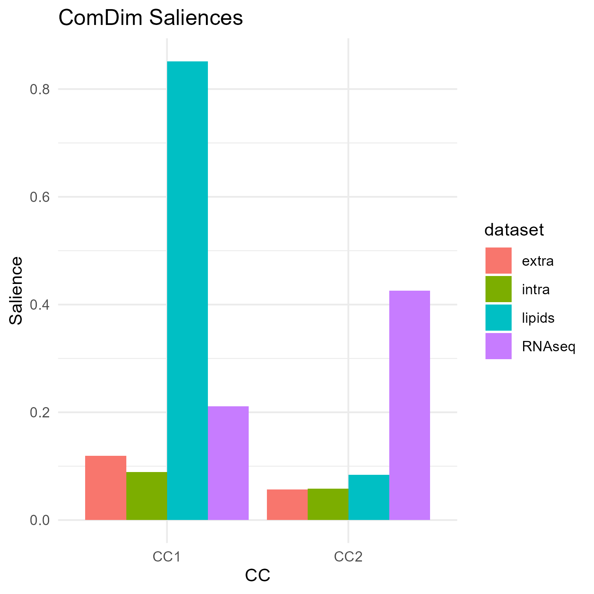
```
```{r, echo=FALSE, out.width="50%", fig.align='center'}
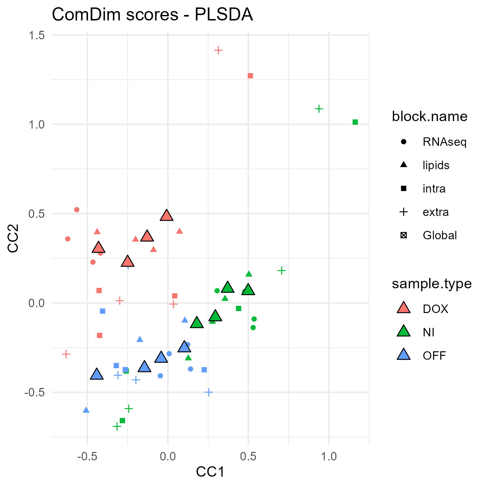
```
```{r, echo=FALSE, out.width="50%", fig.align='center'}
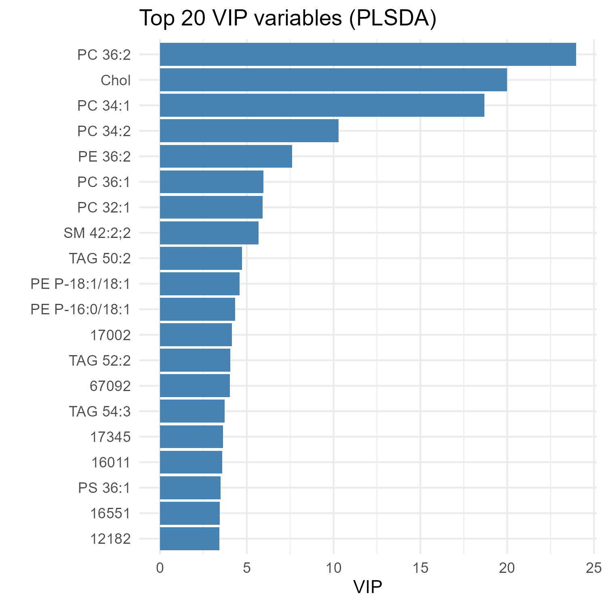
```

### Predicting new samples with ComDim-PLSDA

The function `PredictMultiBlock()` projects a new `MultiBlock` dataset into an
existing `ComDim` model.  It computes global and local scores for the new
samples, predicts the Y-block (class assignments for PLSDA), and — when the
true labels `y` are supplied — also returns Q2, DQ2, sensitivity,
specificity and a confusion matrix for the new samples.

```{r PLSDA-predict, echo = TRUE, eval = FALSE}
# Split the dataset into a training set (9 samples, 3 per class)
# and a test set (3 samples, 1 per class).
allMB_train <- FilterSamplesMultiBlock(allMB, sampleNames(allMB)[c(1:3, 5:7, 9:11)])
allMB_test  <- FilterSamplesMultiBlock(allMB, sampleNames(allMB)[c(4, 8, 12)])

y_train <- c(rep('NI', 3), rep('DOX', 3), rep('OFF', 3))

# Fit the model on the training set
modelPLSDA <- ComDim_PLS(allMB_train, y = y_train,
                             ndim = 2, method = 'PLS-DA')

# Project the 3 test samples; supply true labels to get Q2/DQ2 and statistics
y_test <- c('NI', 'DOX', 'OFF')
predPLSDA <- PredictMultiBlock(allMB_test, y = y_test, model = modelPLSDA)

predPLSDA@Prediction$Y.pred          # Raw predicted Y scores --> Need to have class names and sample names.
predPLSDA@Prediction$predClass        # Predicted class assignments
predPLSDA@Prediction$confusionMatrix  # Confusion matrix for test set
predPLSDA@Q2                          # Q2 for test samples per class
predPLSDA@DQ2                         # DQ2 for test samples per class

# Plot training and test samples on the model score space
trainQ <- as.data.frame(modelPLSDA@Q.scores) %>%
  mutate(sample.id   = rownames(modelPLSDA@Q.scores),
         sample.type = case_when(grepl('DOX', sample.id) ~ 'DOX',
                                 grepl('NI',  sample.id) ~ 'NI',
                                 grepl('OFF', sample.id) ~ 'OFF'),
         set = 'Train')

testQ <- as.data.frame(predPLSDA@Q.scores) %>%
  mutate(sample.id   = rownames(predPLSDA@Q.scores),
         sample.type = y_test,
         set = 'Test')

allQ_PLSDA <- bind_rows(trainQ, testQ)

ggplot(allQ_PLSDA, aes(x = CC1, y = CC2, color = sample.type, shape = set)) +
  geom_point(size = 3) +
  theme_minimal() +
  labs(title = 'PLSDA: Training and test scores', x = 'CC1', y = 'CC2')
```

```{r, echo=FALSE, out.width="50%", fig.align='center'}
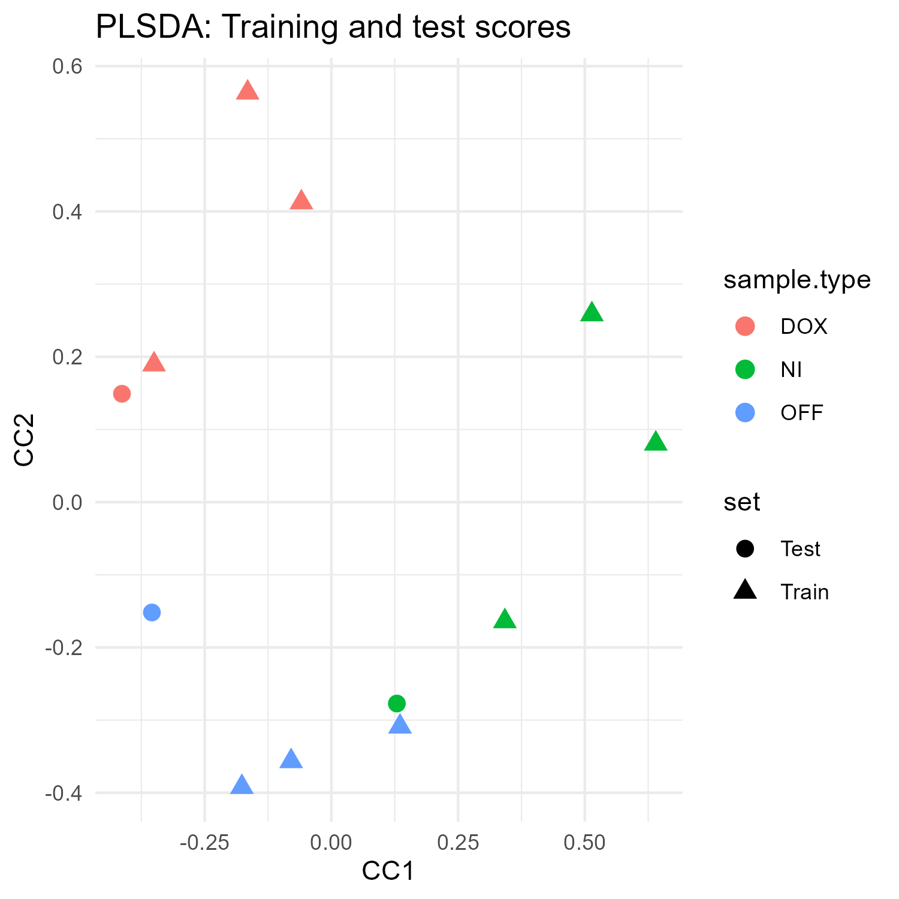
```


## ComDim-Partial Least Squares Regression (ComDim-PLSR) {#PLS}

**ComDim-PLS** can be executed with the same function `ComDim_PLS()`, by
providing a `y` regression vector (i.e. numerical) and setting
`method = 'PLS-R'`.
The output contains the typical PLS figures of merit
(**R2X**, **R2Y**, **Q2**), the **VIP** scores, the PLS regression
coefficients **B** and **B0**, and the **predicted y** values.

```{r PLSR, echo = TRUE, eval = FALSE}
# Training: 9 samples (3 per class); test: 3 samples (one per class, held out).
# The training and test sets are non-overlapping.
allMB_train <- FilterSamplesMultiBlock(allMB, sampleNames(allMB)[setdiff(1:12,c(2,6,10))])
allMB_test  <- FilterSamplesMultiBlock(allMB, sampleNames(allMB)[c(2, 6, 10)])

# Numerical response: 1 = NI, 2 = DOX, 3 = OFF
y_train <- rep(1:3, each = 3)

# Fit ComDim-PLS-R with 2 components
resultsPLSR <- ComDim_PLS(allMB_train,
                              y = y_train,
                              ndim = 2, method = 'PLS-R')

# Figures of merit
resultsPLSR@R2X
resultsPLSR@R2Y   # Cumulative R2Y per CC (CC1, CC2)
resultsPLSR@Q2    # Cross-validated Q2

# Regression coefficients and training-set predictions
head(resultsPLSR@PLS.model$B)       # B has variable names as rownames
resultsPLSR@Prediction$Y.pred       # Training predictions (sample names in rownames)

# Project the test set
y_test <- c(1, 2, 3)  # True y values for the 3 test samples
predPLSR <- PredictMultiBlock(allMB_test, y = y_test, model = resultsPLSR)

predPLSR@Prediction$Y.pred  # Predicted y for the 3 test samples
predPLSR@Q2                 # Q2 for the test set

# Plot predicted vs actual Y for training and test sets
pred_df <- rbind(
  data.frame(actual    = y_train,
             predicted = as.vector(resultsPLSR@Prediction$Y.pred),
             set       = 'Train'),
  data.frame(actual    = y_test,
             predicted = as.vector(predPLSR@Prediction$Y.pred),
             set       = 'Test')
)

ggplot(pred_df, aes(x = actual, y = predicted, color = set)) +
  geom_point(size = 3) +
  geom_abline(intercept = 0, slope = 1, linetype = 'dashed') +
  theme_minimal() +
  labs(title = 'PLSR: Predicted vs Actual', x = 'Actual Y', y = 'Predicted Y')
```

```{r, echo=FALSE, out.width="50%", fig.align='center'}
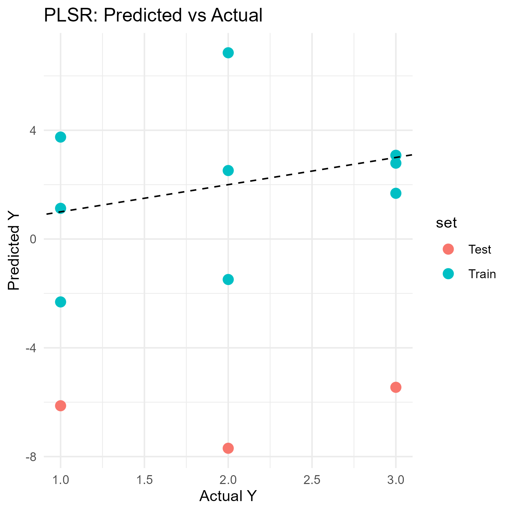
```


## ComDim-Orthogonal PLS (ComDim-OPLS) {#OPLS}

**ComDim-OPLS** is executed with the function `ComDim_OPLS()`.  It extends
the PLS formulation by extracting **orthogonal components** — systematic
variation in X that is *uncorrelated* with Y — before computing the predictive
component(s).  This produces a cleaner separation between structured noise and
the Y-relevant signal, and is especially useful when many orthogonal sources of
variation exist in the data (e.g. batch effects, biological confounders).

The function supports both **discriminant analysis** (`method = 'OPLS-DA'`)
and **regression** (`method = 'OPLS-R'`).  The number of predictive components
is controlled by `ndim` (default 1) and the number of orthogonal components by
`nort` (default 1).

The output object is a `ComDim` object that contains, in addition to the usual
predictive slots:

- `@Orthogonal` — a list with the orthogonal scores (`Q.scores`, `T.scores`),
  orthogonal loadings (`P.loadings.ort`), and orthogonal saliences
  (`Saliences.ort`).
- `@VIP` / `@VIP.block` — VIP scores with three columns per block: `p`
  (predictive VIP), `o` (orthogonal VIP), and `tot` (combined total VIP,
  used in `@VIP`).
- `@R2X`, `@R2Y`, `@Q2`, `@DQ2` (OPLS-DA only) — the usual figures of merit.

```{r OPLS-DA, echo = TRUE, eval = TRUE}
# ComDim-OPLS-DA: 1 predictive component, 1 orthogonal component
resultsOPLSDA <- ComDim_OPLS(allMB,
                                 y = c(rep('NI', 4), rep('DOX', 4), rep('OFF', 4)),
                                 ndim = 1, nort = 1,
                                 method = 'OPLS-DA')

# Figures of merit
resultsOPLSDA@R2X
resultsOPLSDA@R2Y
resultsOPLSDA@Q2   # Cross-validated Q2 per class
resultsOPLSDA@DQ2  # Cross-validated discriminant Q2

# Sores and saliences
head(resultsOPLSDA@Q.scores )     # Global predictive scores (n x ndim)
resultsOPLSDA@Saliences     # Predictive saliences (ntable x ndim)

# Orthogonal components
resultsOPLSDA@Orthogonal$nort          # Number of orthogonal components
head(resultsOPLSDA@Orthogonal$Q.scores)      # Global orthogonal scores (n x nort)
head(resultsOPLSDA@Orthogonal$Saliences.ort) # Orthogonal saliences (ntable x nort)

# VIP scores (predictive 'p', orthogonal 'o', total 'tot')
head(resultsOPLSDA@VIP)           # Global total VIP (one value per variable)
head(resultsOPLSDA@VIP.block[['RNAseq']]) # Per-block VIP (list of data.frames with p, o, tot)

# Classification outputs
resultsOPLSDA@Prediction$predClass
resultsOPLSDA@Prediction$confusionMatrix
resultsOPLSDA@Prediction$Sensitivity
resultsOPLSDA@Prediction$Specificity
```

```{r OPLS-DA2, echo = TRUE, eval = FALSE}
# Plot scores: predictive vs orthogonal component
scoresOPLS <- MakeComDimScoresTable(model = resultsOPLSDA,
                                    include = c('Q.scores', 'Q.scores.ort'))

scoresOPLS_wider <- scoresOPLS %>%
  filter(block.name %in% c('Global', 'Global.ort')) %>%
  mutate(sample.type = case_when(grepl('DOX', sample.id) ~ 'DOX',
                                 grepl('NI',  sample.id) ~ 'NI',
                                 grepl('OFF', sample.id) ~ 'OFF')) %>%
  dplyr::select(sample.id, sample.type, scores.type.dim, value) %>%
  pivot_wider(names_from = scores.type.dim, values_from = value)

ggplot(scoresOPLS_wider, aes(x = Q.scores1, y = Q.scores.ort1, color = sample.type)) +
  geom_point(size = 3) +
  theme_minimal() +
  labs(title = 'ComDim OPLS-DA scores',
       x = 'Predictive CC1', y = 'Orthogonal CC1')

# Plot predictive and orthogonal saliences side by side
saliences_pred <- as.data.frame(resultsOPLSDA@Saliences) %>%
  mutate(dataset   = rownames(resultsOPLSDA@Saliences),
         component = 'Predictive') %>%
  rename(Salience = CC1)

saliences_ort <- as.data.frame(resultsOPLSDA@Orthogonal$Saliences.ort) %>%
  mutate(dataset   = rownames(resultsOPLSDA@Orthogonal$Saliences.ort),
         component = 'Orthogonal') %>%
  rename(Salience = ort1)

bind_rows(saliences_pred, saliences_ort) %>%
  ggplot(aes(x = component, y = Salience, fill = dataset)) +
  geom_bar(stat = 'identity', position = 'dodge') +
  theme_minimal() +
  labs(title = 'ComDim OPLS-DA Saliences',
       x = 'Component type', y = 'Salience')
```

```{r, echo=FALSE, out.width="50%", fig.align='center'}
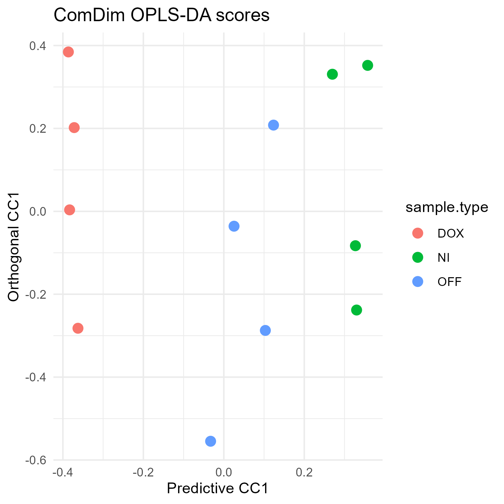
```
```{r, echo=FALSE, out.width="50%", fig.align='center'}
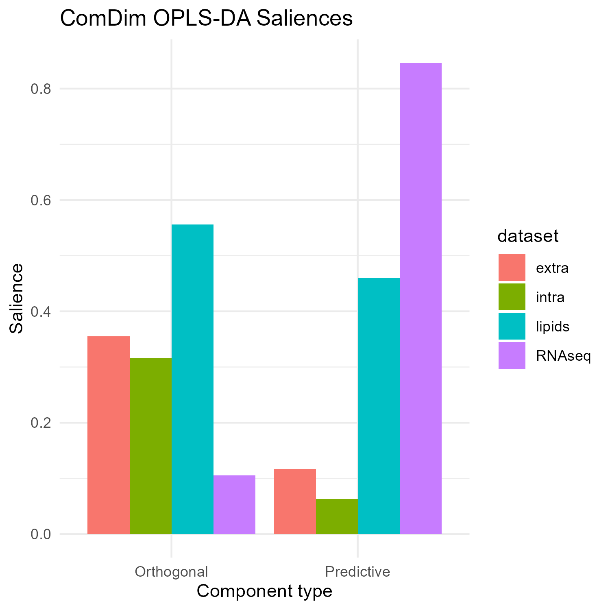
```

The predictive scores can be projected onto new data with `PredictMultiBlock()`.
For OPLS models the function first applies **orthogonal deflation** (using the
stored `P.loadings.ort`) before computing the predictive scores, so the
pipeline is consistent with the calibration procedure.

```{r OPLS-predict, echo = TRUE, eval = FALSE}
# Project the last 4 samples through the OPLS-DA model
allMB_test <- FilterSamplesMultiBlock(allMB, sampleNames(allMB)[9:12])

predOPLSDA <- PredictMultiBlock(allMB_test, model = resultsOPLSDA)

predOPLSDA@Q.scores                  # Predictive scores for the test samples
predOPLSDA@Orthogonal$Q.scores       # Orthogonal scores for the test samples
predOPLSDA@Prediction$Y.pred         # Predicted Y (dummy matrix)
predOPLSDA@Prediction$predClass      # Predicted class assignments

# Plot training and test samples together
trainQ_opls <- as.data.frame(resultsOPLSDA@Q.scores) %>%
  mutate(sample.id   = rownames(resultsOPLSDA@Q.scores),
         Q.ort1      = resultsOPLSDA@Orthogonal$Q.scores[, 1],
         sample.type = case_when(grepl('DOX', sample.id) ~ 'DOX',
                                 grepl('NI',  sample.id) ~ 'NI',
                                 grepl('OFF', sample.id) ~ 'OFF'),
         set = 'Train')

testQ_opls <- as.data.frame(predOPLSDA@Q.scores) %>%
  mutate(sample.id   = rownames(predOPLSDA@Q.scores),
         Q.ort1      = predOPLSDA@Orthogonal$Q.scores[, 1],
         sample.type = case_when(grepl('DOX', sample.id) ~ 'DOX',
                                 grepl('NI',  sample.id) ~ 'NI',
                                 grepl('OFF', sample.id) ~ 'OFF'),
         set = 'Test')

allQ_opls <- bind_rows(trainQ_opls, testQ_opls)

ggplot(allQ_opls, aes(x = CC1, y = Q.ort1, color = sample.type, shape = set)) +
  geom_point(size = 3) +
  theme_minimal() +
  labs(title = 'OPLS-DA: Training and test scores',
       x = 'Predictive CC1', y = 'Orthogonal CC1')
```

```{r, echo=FALSE, out.width="50%", fig.align='center'}
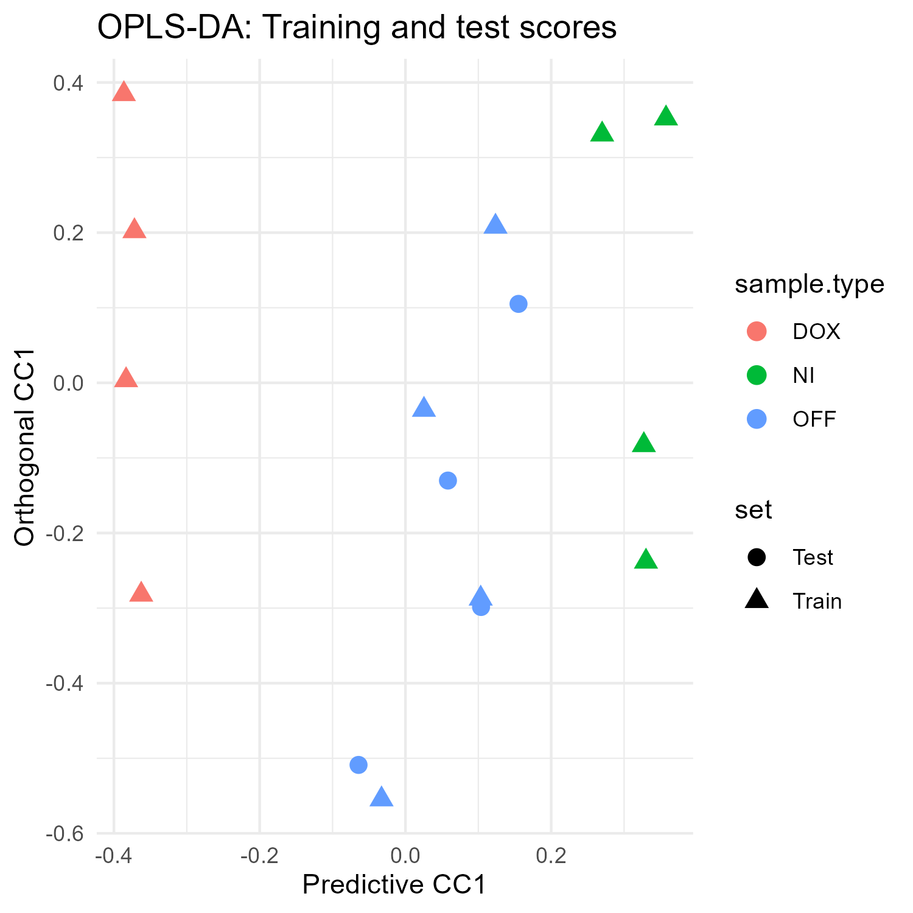
```

For **regression** with OPLS, simply switch `method = 'OPLS-R'` and supply a
numerical `y` vector:

```{r OPLS-R, echo = TRUE, eval = FALSE}
resultsOPLSR <- ComDim_OPLS(allMB,
                                y = c(rep(1, 4), rep(5, 4), rep(10, 4)),
                                ndim = 1, nort = 1,
                                method = 'OPLS-R')

resultsOPLSR@R2X
resultsOPLSR@R2Y
resultsOPLSR@Q2

head(resultsOPLSR@Prediction$Y.pred)

# Plot predicted vs actual Y
y_actual <- c(rep(1, 4), rep(5, 4), rep(10, 4))

ggplot(data.frame(actual    = y_actual,
                  predicted = as.vector(resultsOPLSR@Prediction$Y.pred)),
       aes(x = actual, y = predicted)) +
  geom_point(size = 3, color = 'steelblue') +
  geom_abline(intercept = 0, slope = 1, linetype = 'dashed') +
  theme_minimal() +
  labs(title = 'OPLS-R: Predicted vs Actual', x = 'Actual Y', y = 'Predicted Y')
```

```{r, echo=FALSE, out.width="50%", fig.align='center'}
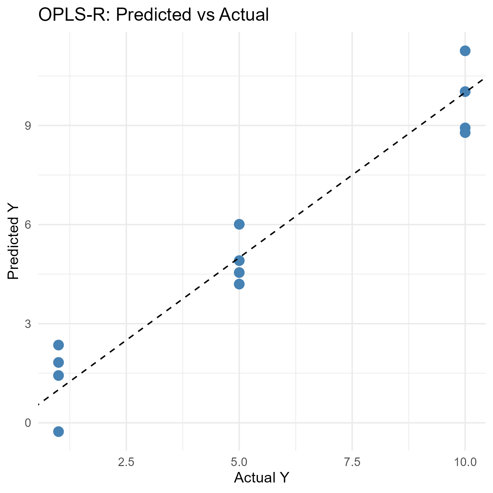
```


## Computation strategies: `CompMethod` and `Partitions` {#compmethod}

All ComDim functions accept a `CompMethod` argument that controls the internal
algorithm used to compute the common dimensions. For most datasets the default
(`'Normal'`) is fine, but the alternatives can give large speed gains when the
data geometry is extreme (many more variables than samples, or a very large
number of samples).

| `CompMethod` | Description |
|---|---|
| `'Normal'` | Exact SVD on the full concatenated block (default) |
| `'Kernel'` | Works on the *n × n* kernel matrix instead of the *p × n* data matrix. |
| `'PCT'` | PCA pre-compression before the ComDim step, recommended for large blocks with redundant variables |
| `'Wide'` | Column-partitioned computation, recommended for very wide blocks |
| `'Tall'` | Row-partitioned computation, recommended for blocks with many samples and with *n >> p* |

The `Partitions` argument is an integer divisor used with `'Tall'` and `'Wide'`
to control how the data are split. It can also be used with `'Kernel'` and
`'PCT'` to limit memory use during pre-compression.

```{r compmethod, echo = TRUE, eval = FALSE}
# Synthetic dataset: 500 samples, 2 x 1 000 variables, 4 latent sources,
# 5 % noise.  seed = 42 ensures the example is fully reproducible.
allMB <- SimulateMultiBlock(n = 500, p = 2000, n_sources = 4,
                            noise = 0.05, n_blocks = 2, seed = 42)
allMB <- NAInfRemoveMultiBlock(allMB, na.method = 'none', minfrac = 0.2)
allMB <- NormalizeMultiBlock(allMB, method = 'norm')

# Default: exact SVD — accurate for any dataset size
t_normal <- system.time(
  results_normal <- ComDim_PCA(allMB, ndim = 4, CompMethod = 'Normal')
)

# Kernel: build an n×n cross-product matrix — requires n < p per block
# (here n = 500, p = 1 000 per block, so the condition is satisfied)
t_kernel <- system.time(
  results_kernel <- ComDim_PCA(allMB, ndim = 4, CompMethod = 'Kernel')
)

# PCT: compress each block with PCA first, then run ComDim on the scores
t_pct <- system.time(
  results_pct    <- ComDim_PCA(allMB, ndim = 4, CompMethod = 'PCT')
)

# Wide: partition the blocks column-wise; Partitions controls how many pieces
t_wide <- system.time(
  results_wide   <- ComDim_PCA(allMB, ndim = 4,
                               CompMethod = 'Wide', Partitions = 3)
)

# Tall: partition row-wise — only suitable when blocks are narrow (< 1 000 vars)
t_tall <- system.time(
  results_tall   <- ComDim_PCA(allMB, ndim = 4,
                               CompMethod = 'Tall', Partitions = 3)
)

# Elapsed time per method
timing_df <- data.frame(
  Method  = c('Normal', 'Kernel', 'PCT', 'Wide', 'Tall'),
  Seconds = c(t_normal['elapsed'], t_kernel['elapsed'],
              t_pct['elapsed'],    t_wide['elapsed'],
              t_tall['elapsed'])
)
print(timing_df)

ggplot(timing_df, aes(x = reorder(Method, Seconds), y = Seconds, fill = Method)) +
  geom_bar(stat = 'identity') +
  coord_flip() +
  theme_minimal() +
  theme(legend.position = 'none') +
  labs(title = 'ComDim_PCA computation time by CompMethod',
       subtitle = '500 samples × 2 × 1 000 variables, 4 components',
       x = 'CompMethod', y = 'Elapsed time (s)')

# All methods return equivalent results; compare saliences for CC1 as a check
sal_compare <- bind_rows(
  as.data.frame(results_normal@Saliences) %>%
    mutate(dataset = rownames(.), method = 'Normal'),
  as.data.frame(results_kernel@Saliences) %>%
    mutate(dataset = rownames(.), method = 'Kernel'),
  as.data.frame(results_pct@Saliences) %>%
    mutate(dataset = rownames(.), method = 'PCT'),
  as.data.frame(results_wide@Saliences) %>%
    mutate(dataset = rownames(.), method = 'Wide'),
  as.data.frame(results_tall@Saliences) %>%
    mutate(dataset = rownames(.), method = 'Tall')
) %>%
  pivot_longer(cols = starts_with('CC'), names_to = 'CC', values_to = 'Salience')

ggplot(sal_compare %>% filter(CC == 'CC1'),
       aes(x = dataset, y = Salience, fill = method)) +
  geom_bar(stat = 'identity', position = 'dodge') +
  theme_minimal() +
  theme(axis.text.x = element_text(angle = 45, hjust = 1)) +
  labs(title = 'Saliences CC1:\nComparison across CompMethods',
       x = 'Block', y = 'Salience')
```

```{r, echo=FALSE, out.width="60%", fig.align='center'}
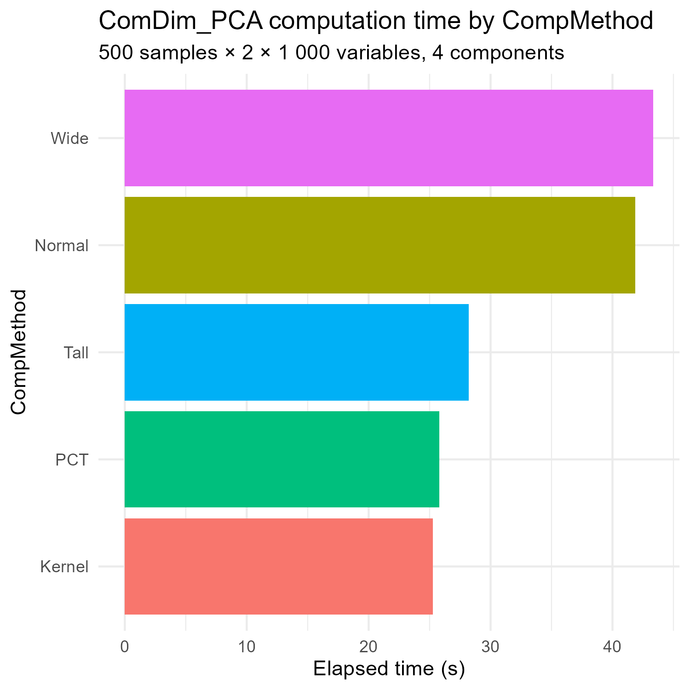
```
```{r, echo=FALSE, out.width="60%", fig.align='center'}
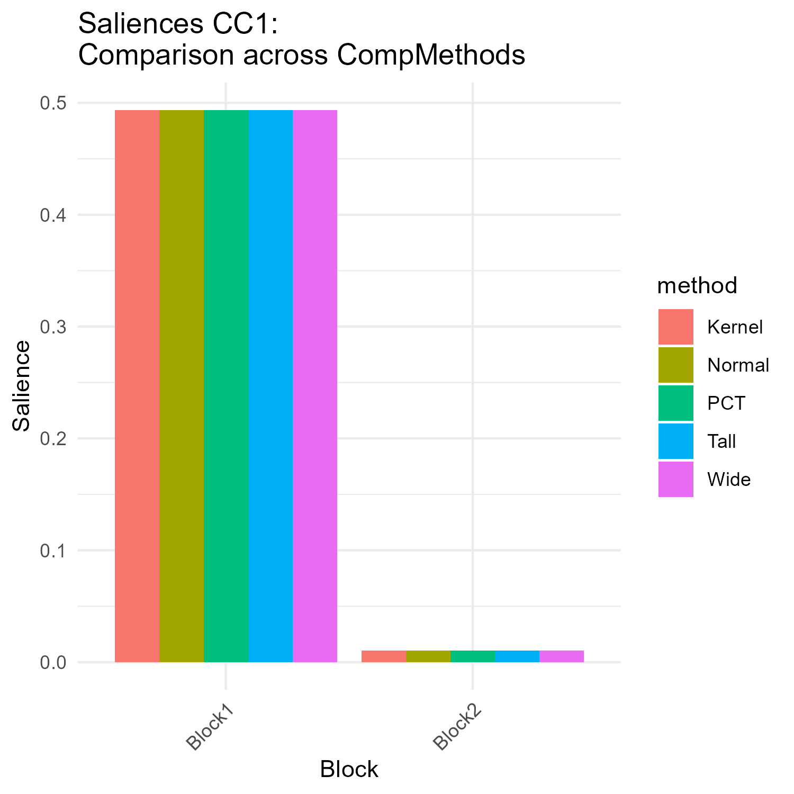
```

All methods return identical (or near-identical) results; the choice only
affects computation time and memory footprint.

The same `CompMethod` and `Partitions` arguments are available in
`ComDim_PLS()` and `ComDim_OPLS()`.


## Other extensions {#Other}

The `ComDim_Exploratory()` and `ComDim_y()` functions enable highly customized Com-Dim implementations for exploratory and regression/discriminant analysis. By utilizing the `FUN` parameter, you can integrate any chemometric method that performs bilinear decompositions into the Com-Dim core. This flexible approach generates method-specific scores alongside loadings and saliences, allowing you to simultaneously evaluate individual variable impacts and overall block contributions.

### Example of ComDim-ICA

The function used to execute **Independent Component Analysis (ICA)** was
`ica()` from the `ica` package.
In order for the `ComDim_Exploratory()` function to understand the output
of `ica()`, we embedded it into another function that returns the source
estimates (representative of the samples information, analogous to the PCA
scores) named `fun.ICA`.
```{r ica, echo = TRUE, eval = FALSE}
library(ica)

fun.ICA <- function(W, ndim,...){
  # W is the concatenated MB.
  # ndim is the number of components.
  # X and nc are the arguments of ica::ica.
  result <- ica::ica(W, ndim)
  sources <- result$S
  # The function must return the source estimates
  # The analogue to the PCA scores for ICA.
  return(sources)
}

# Reload mouse_ds for this section (allMB was overwritten by compmethod)
data(mouse_ds)
allMB_ica <- MultiBlock(Data = list(b1 = RNAseq3, b2 = lipids,
                                    b3 = intra,   b4 = extra))
blockNames(allMB_ica) <- c('RNAseq', 'lipids', 'intra', 'extra')
allMB_ica <- ProcessMultiBlock(allMB_ica, blocks = 'RNAseq',
  FUN.SelectVars = function(x) {apply(x,2,max) > max(x, na.rm=TRUE)*0.001})
allMB_ica <- NAInfRemoveMultiBlock(allMB_ica, blocks = 'RNAseq',
                                   na.method = 'fixed.value.all', constant = 1)
allMB_ica <- ProcessMultiBlock(allMB_ica, blocks = 'RNAseq',
                                FUN = function(x){t(DESeq2::rlog(t(x)))})
allMB_ica <- NAInfRemoveMultiBlock(allMB_ica, na.method = 'random.noise')
allMB_ica <- NormalizeMultiBlock(allMB_ica, method = 'norm')

resultsICA <- ComDim_Exploratory(allMB_ica, ndim = 2,
                                 FUN = fun.ICA,
                                 method = 'ICA')

# Plot saliences
saliencesICA <- resultsICA@Saliences %>%
  as.data.frame() %>%
  mutate(dataset = rownames(.)) %>%
  pivot_longer(cols = c('CC1','CC2'), names_to = 'CC', values_to = 'Salience')

ggplot(data = saliencesICA,
       aes(x = CC, y = Salience, group = dataset)) +
  geom_bar(stat = 'identity', position = 'dodge', aes(fill = dataset)) +
  theme_minimal() +
  labs(title = 'ComDim-ICA Saliences')

# Plot scores
scoresICA <- MakeComDimScoresTable(model = resultsICA)
scoresICA_wider <- scoresICA %>%
  mutate(sample.type = case_when(grepl('DOX', sample.id) ~ 'DOX',
                                 grepl('NI',  sample.id) ~ 'NI',
                                 grepl('OFF', sample.id) ~ 'OFF')) %>%
  dplyr::select(sample.id, sample.type, block.name, scores.type.dim, value) %>%
  dplyr::group_by(sample.id, sample.type, scores.type.dim, block.name) %>%
  pivot_wider(names_from = scores.type.dim, values_from = value)

ggplot(data = scoresICA_wider) +
  geom_point(aes(x = T.scores1, y = T.scores2,
                 color = sample.type, shape = block.name)) +
  geom_point(aes(x = Q.scores1, y = Q.scores2,
                 fill = sample.type),
             size = 3, shape = 24, color = 'black') +
  theme_minimal() +
  labs(title = 'ComDim-ICA scores', x = 'CC1', y = 'CC2')
```

```{r, echo=FALSE, out.width="50%", fig.align='center'}
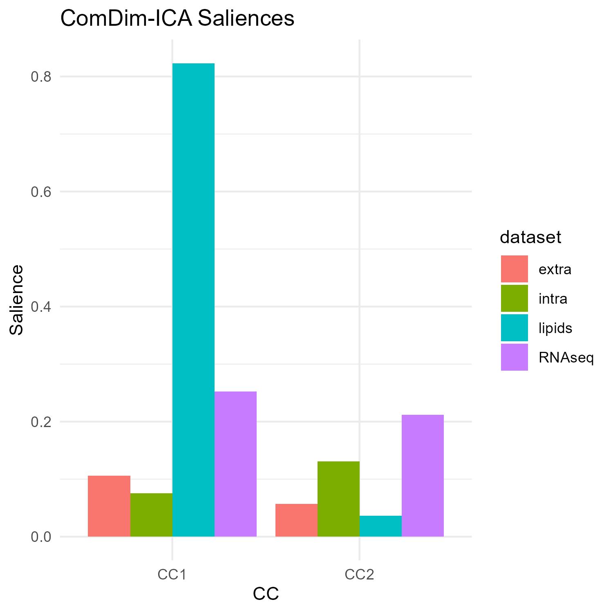
```
```{r, echo=FALSE, out.width="50%", fig.align='center'}
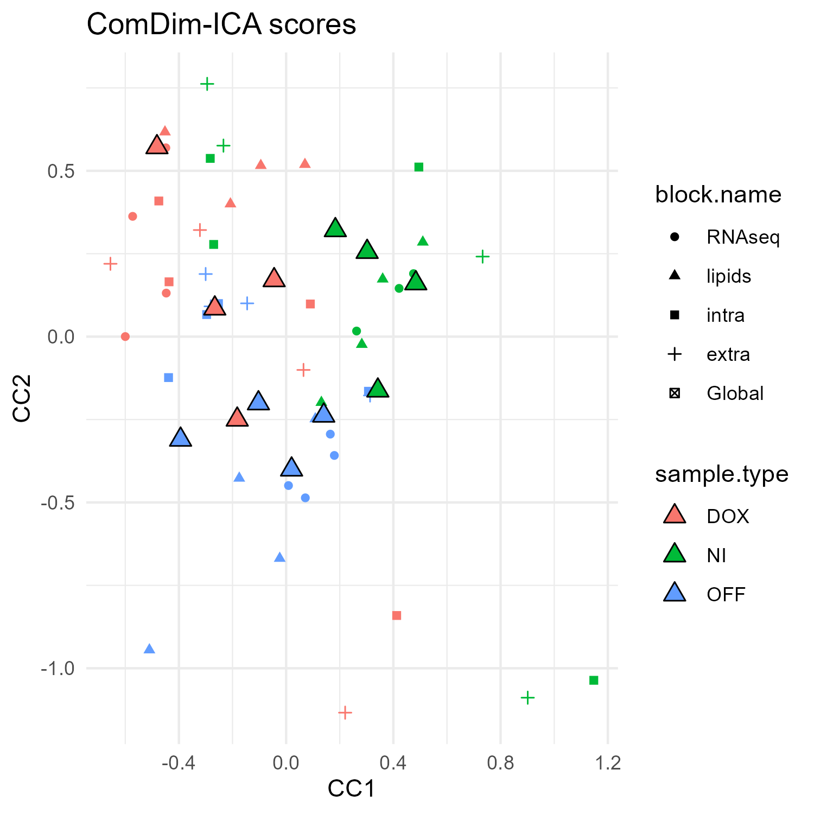
```

### Example of ComDim-PLS (version ropls)

The function used to execute **PLS** here was `opls()`, obtained from the
`ropls` package.
In this case, `fun.PLS` is used to capture the output from the PLS analysis
(scores,P,W,U,Q,y).
`type=regression` is set to calculate R2Y, Q2,... as with `ComDim_Pls_MB()`.
```{r ropls1, echo = TRUE, eval = FALSE}
library(ropls) # From bioconductor
fun.PLS <- function(W, y, ndim,...){
  # W is the concatenated MB.
  # ndim is the number of components.
  # X and nc are the arguments of ica::ica.
  output <- list()
  result <- ropls::opls(x = W, y = y, predI = ndim,
                        fig.pdfC = 'none',
                        info.txtC = 'none')
  # The returning object must be a list containing the following 6 elements:
  output$scores <- result@scoreMN[,1]
  output$P <- result@loadingMN[,1]
  output$W <- result@weightMN[,1]
  output$U <- result@uMN[,1]
  output$Q <- result@cMN[,1]
  output$y <- result@suppLs$yModelMN
  return(output)
}
resultsPLS <- ComDim_y(allMB_ica,
                          y = c(rep(1,4), rep(5,4), rep(10,4)),
                          ndim = 2,
                          type = 'regression',
                          FUN = fun.PLS,
                          method = 'PLS(ropls)')

resultsPLS@R2X
resultsPLS@R2Y
resultsPLS@Q2

# Plot saliences
saliencesPLS_ropls <- resultsPLS@Saliences %>%
  as.data.frame() %>%
  mutate(dataset = rownames(.)) %>%
  pivot_longer(cols = c('CC1','CC2'), names_to = 'CC', values_to = 'Salience')

ggplot(data = saliencesPLS_ropls,
       aes(x = CC, y = Salience, group = dataset)) +
  geom_bar(stat = 'identity', position = 'dodge', aes(fill = dataset)) +
  theme_minimal() +
  labs(title = 'ComDim-PLS (ropls) Saliences')

# Plot predicted vs actual Y
ggplot(data.frame(actual    = c(rep(1,4), rep(5,4), rep(10,4)),
                  predicted = as.vector(resultsPLS@Prediction$Y.pred)),
       aes(x = actual, y = predicted)) +
  geom_point(size = 3, color = 'steelblue') +
  geom_abline(intercept = 0, slope = 1, linetype = 'dashed') +
  theme_minimal() +
  labs(title = 'PLS (ropls): Predicted vs Actual', x = 'Actual Y', y = 'Predicted Y')
```

```{r, echo=FALSE, out.width="50%", fig.align='center'}
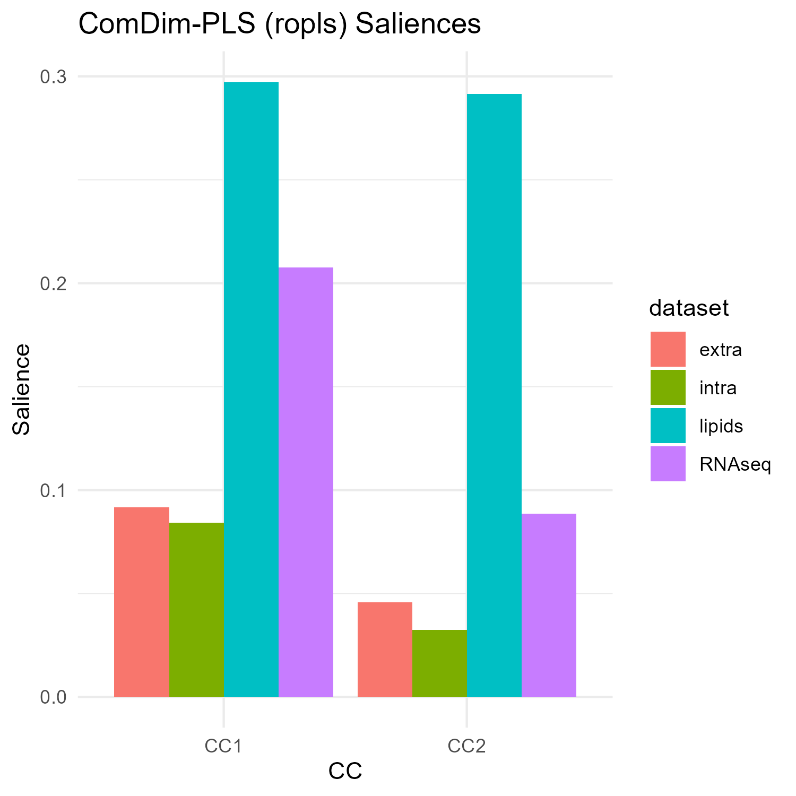
```
```{r, echo=FALSE, out.width="50%", fig.align='center'}
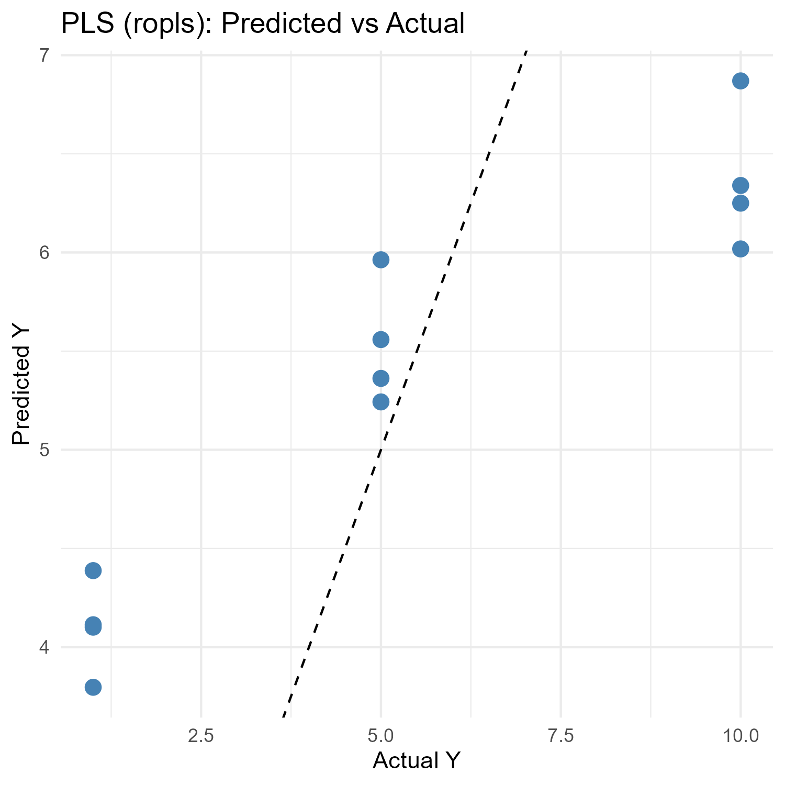
```


### Example of ComDim-PLSDA (version ropls)

For ComDim-PLS-DA, we can use the same function `fun.PLS` as before, but we need
to specify that the `type` of the method is `'discriminant'` and we need to
provide the sample classes in `y`:
```{r ropls2, echo = TRUE, eval = FALSE}
resultsPLSDA_ropls <- ComDim_y(allMB_ica,
                           y = c(rep('NI',4), rep('DOX',4), rep('OFF',4)),
                           ndim = 2,
                           type = 'discriminant',
                           FUN = fun.PLS,
                           method = 'PLSDA(ropls)')

resultsPLSDA_ropls@R2X
resultsPLSDA_ropls@R2Y
resultsPLSDA_ropls@Q2
resultsPLSDA_ropls@DQ2

# Plot saliences
saliencesPLSDA_ropls <- resultsPLSDA_ropls@Saliences %>%
  as.data.frame() %>%
  mutate(dataset = rownames(.)) %>%
  pivot_longer(cols = c('CC1','CC2'), names_to = 'CC', values_to = 'Salience')

ggplot(data = saliencesPLSDA_ropls,
       aes(x = CC, y = Salience, group = dataset)) +
  geom_bar(stat = 'identity', position = 'dodge', aes(fill = dataset)) +
  theme_minimal() +
  labs(title = 'ComDim-PLSDA (ropls) Saliences')

# Plot scores
scoresTable_ropls <- MakeComDimScoresTable(model = resultsPLSDA_ropls)
scoresTable_ropls_wider <- scoresTable_ropls %>%
  mutate(sample.type = case_when(grepl('DOX', sample.id) ~ 'DOX',
                                 grepl('NI',  sample.id) ~ 'NI',
                                 grepl('OFF', sample.id) ~ 'OFF')) %>%
  dplyr::select(sample.id, sample.type, block.name, scores.type.dim, value) %>%
  dplyr::group_by(sample.id, sample.type, scores.type.dim, block.name) %>%
  pivot_wider(names_from = scores.type.dim, values_from = value)

ggplot(data = scoresTable_ropls_wider) +
  geom_point(aes(x = T.scores1, y = T.scores2,
                 color = sample.type, shape = block.name)) +
  geom_point(aes(x = Q.scores1, y = Q.scores2,
                 fill = sample.type),
             size = 3, shape = 24, color = 'black') +
  theme_minimal() +
  labs(title = 'ComDim-PLSDA (ropls) scores', x = 'CC1', y = 'CC2')
```

```{r, echo=FALSE, out.width="50%", fig.align='center'}
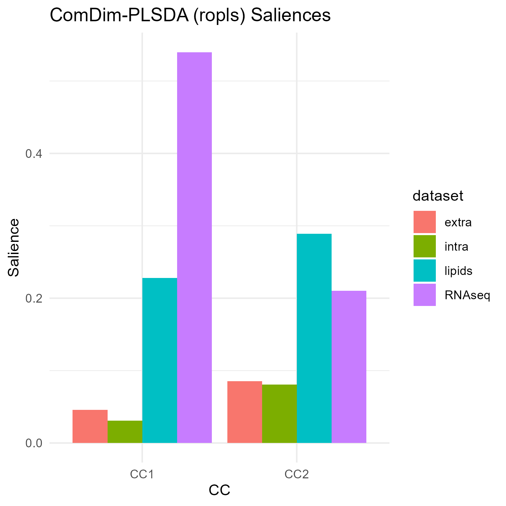
```
```{r, echo=FALSE, out.width="50%", fig.align='center'}
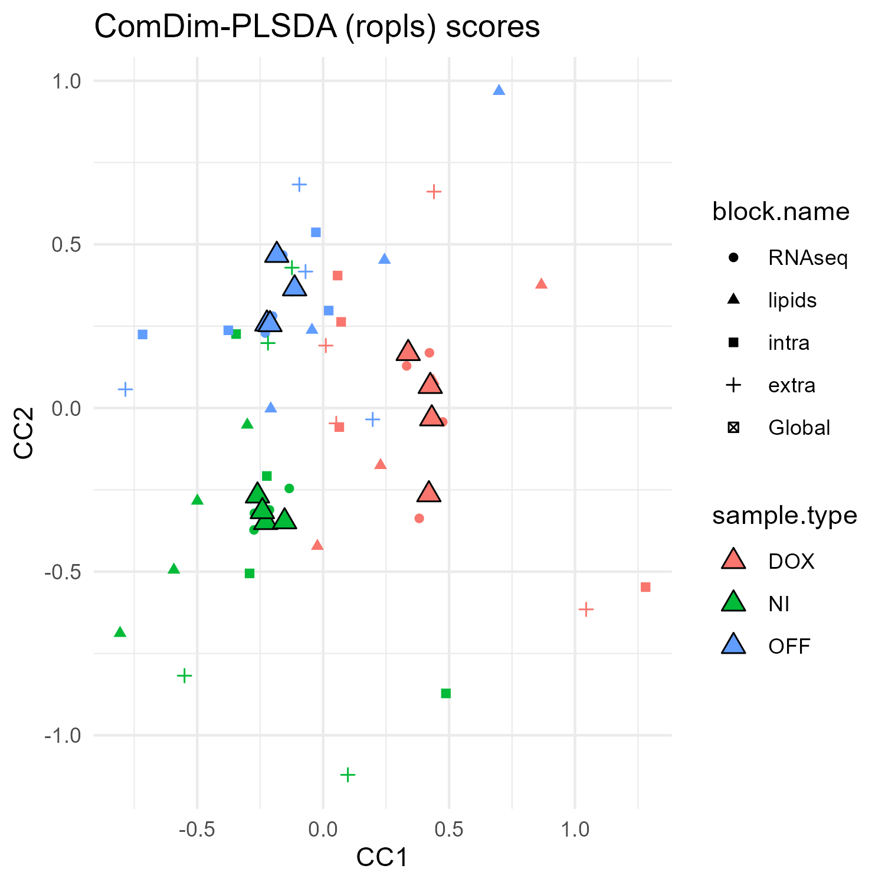
```


### Example of ComDim-OPLSDA (version ropls)

To implement O-PLS as the core of Com-Dim, we follow the same procedure used for ComDim-PLS-DA, but this time the function passed through the `FUN` parameter returns
in addition the orthogonal scores (`orthoscores`).

```{r ropls3, echo = TRUE, eval = FALSE}
# Apply ComDim-OPLSDA on a 2-class subset (NI vs OFF).
allMB_small <- FilterSamplesMultiBlock(allMB_ica,
                                       sampleNames(allMB_ica)[c(1:4, 9:12)])

# OPLS-DA wrapper around ropls::opls.
fun.OPLSDA <- function(W, y, ndim, ...) {
  # ropls requires a -1/+1 vector for binary DA (not a dummy matrix).
  Y <- c(-1, 1)[apply(y, 1, function(x) match(1, x))]

  # Ort phase: ropls finds 1 predictive + 1 orthogonal component.
  result <- ropls::opls(x = W, y = Y, predI = 1, orthoI = 1,
                fig.pdfC = "none", info.txtC = "none")

  # Expand ropls's 1-element Y-loading to the 2-column dummy-matrix format.
  # class 1 (encoded -1) gets -cMN, class 2 (encoded +1) gets +cMN.
  Q_expanded <- c(-result@cMN[, 1], result@cMN[, 1])

  # Orthoscores
  ort_scores <- result@orthoScoreMN 

  list(
    scores      = result@scoreMN[, 1],
    P           = result@loadingMN[, 1],
    W           = result@weightMN[, 1],
    U           = result@uMN[, 1],
    Q           = Q_expanded,
    y           = result@suppLs$yModelMN,
    orthoscores = ort_scores
  )
}

resultsOPLSDA_ropls <- ComDim_y(allMB_small,
                                y = c(rep("NI", 4), rep("OFF", 4)),
                                ndim = 1,
                                nort = 1,
                                type = "discriminant",
                                FUN = fun.OPLSDA,
                                method = "OPLSDA(ropls)",
                                cv.k = 0)

# Figures of merit
resultsOPLSDA_ropls@R2X
resultsOPLSDA_ropls@R2Y
resultsOPLSDA_ropls@Q2

# Plot predictive vs orthogonal scores
scoresOPLS_ropls <- MakeComDimScoresTable(model = resultsOPLSDA_ropls,
                                          include = c("Q.scores", "Q.scores.ort"))

scoresOPLS_ropls_wider <- scoresOPLS_ropls %>%
  filter(block.name %in% c("Global", "Global.ort")) %>%
  mutate(sample.type = case_when(grepl("NI",  sample.id) ~ "NI",
                                 grepl("OFF", sample.id) ~ "OFF")) %>%
  dplyr::select(sample.id, sample.type, scores.type.dim, value) %>%
  pivot_wider(names_from = scores.type.dim, values_from = value)

ggplot(scoresOPLS_ropls_wider,
       aes(x = Q.scores1, y = Q.scores.ort1, color = sample.type)) +
  geom_point(size = 3) +
  theme_minimal() +
  labs(title = "ComDim-OPLSDA (ropls) scores",
       x = "Predictive CC1", y = "Orthogonal CC1")
```

```{r, echo=FALSE, out.width="50%", fig.align='center'}
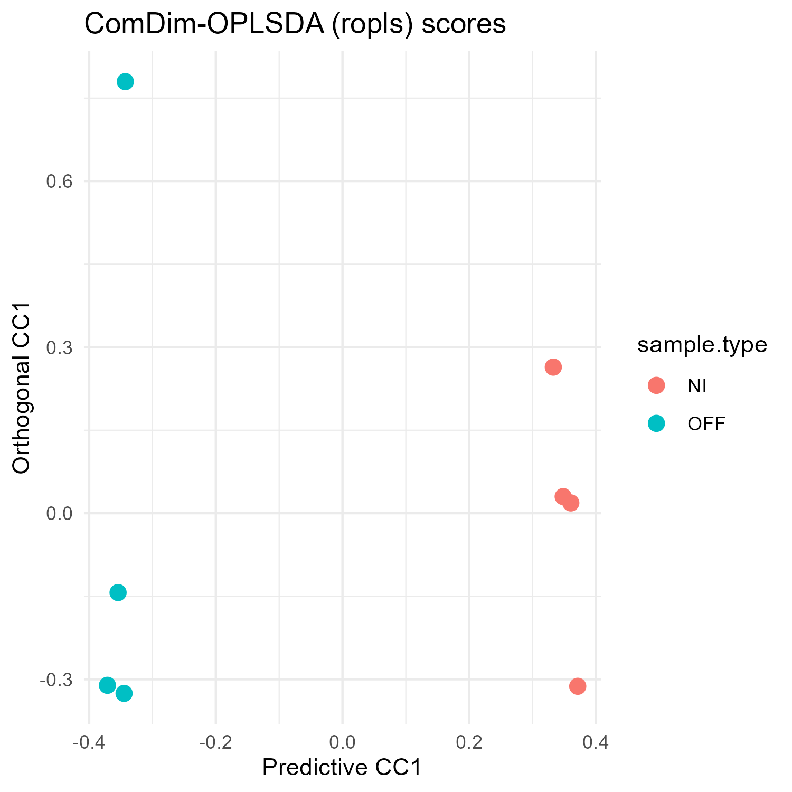
```
