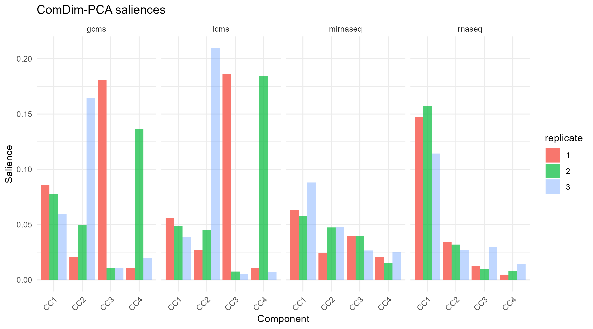
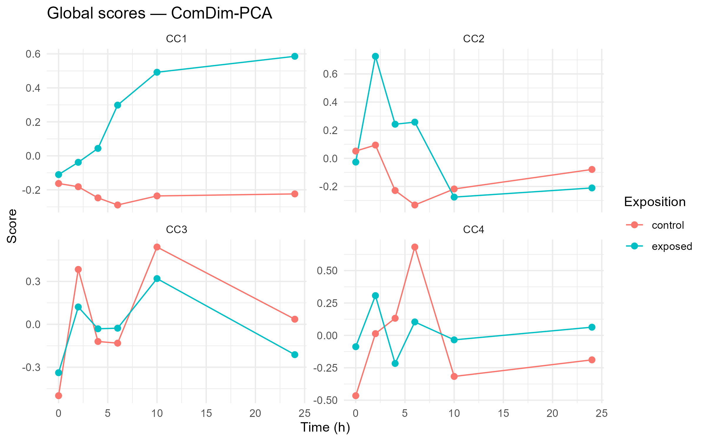
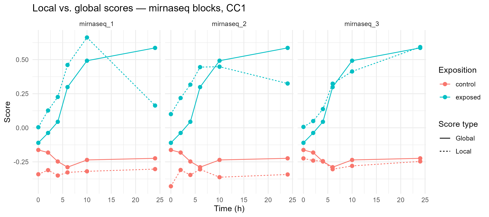
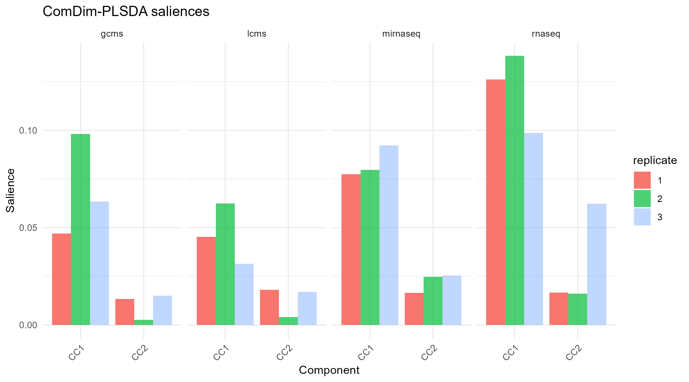
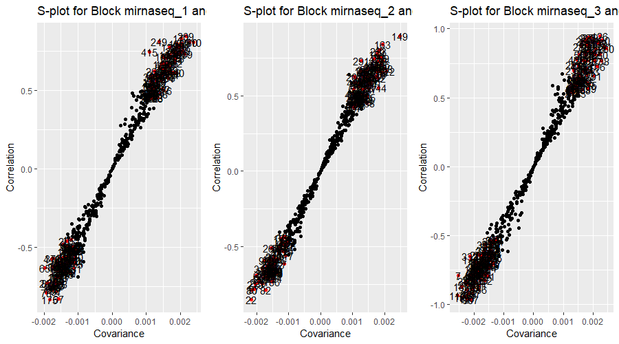
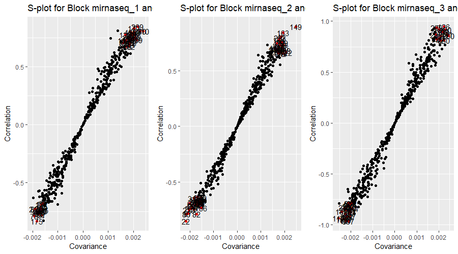
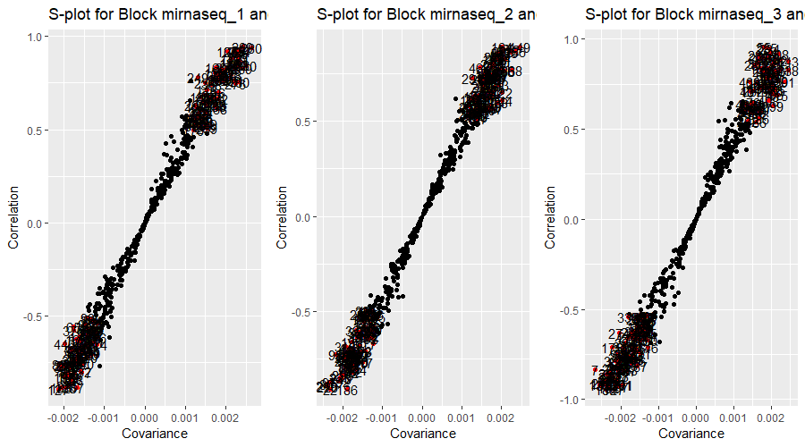
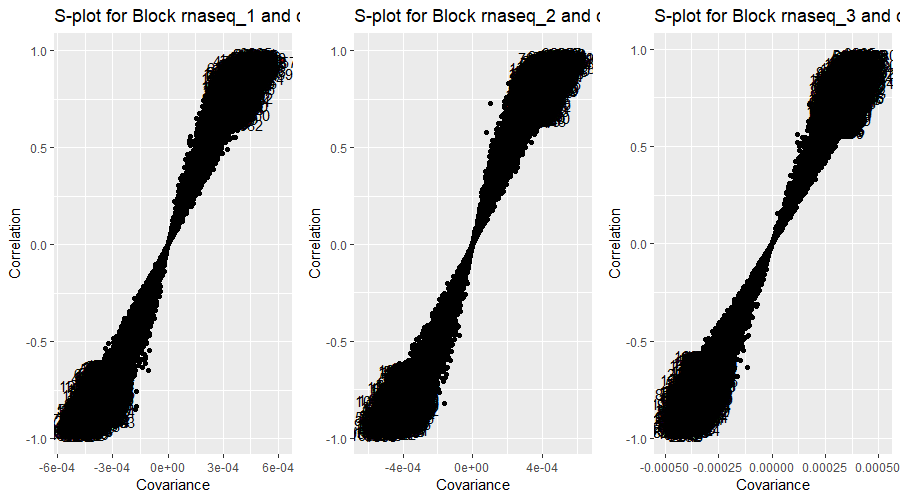
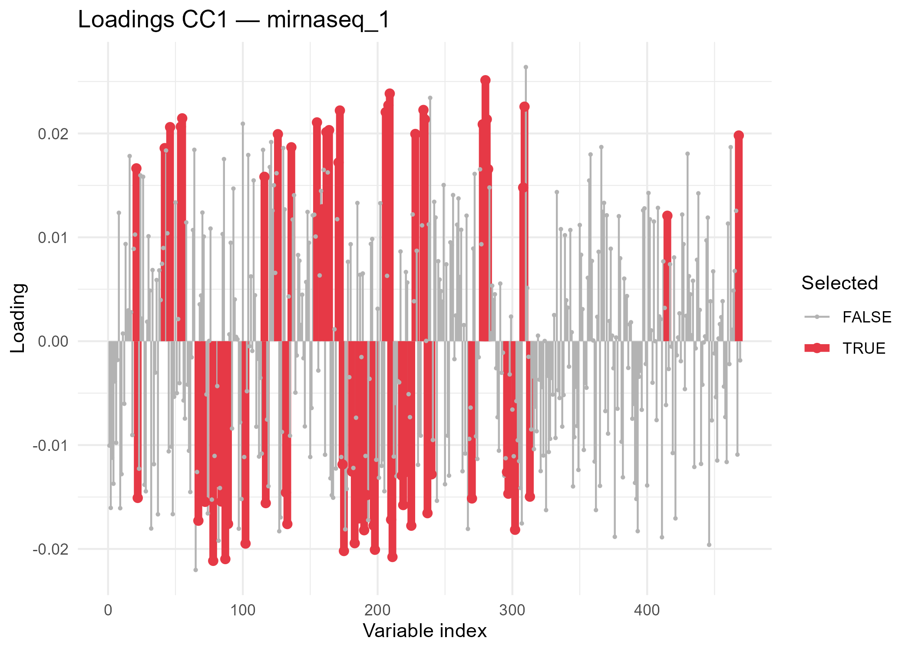

```{r include=FALSE, cache=FALSE}
library(R.ComDim)
knitr::opts_chunk$set(
  fig.align = 'center',
  fig.width = 6,
  fig.height = 5,
  message = FALSE
)
```

# Replicate-Wise (RW) analysis {#Section7}

When the data in a multi-block dataset have been acquired across **multiple
measurement batches** (e.g. three rounds of LC-MS analysis, three RNAseq
sequencing runs, or three independently repeated experiments), we can reorganise
the blocks so that each batch becomes its own block. This reorganised
multi-block is referred to as a **Replicate-Wise (RW)** multi-block.

The main advantages of the RW strategy are:

- **Replicate consistency** — the ComDim saliences directly reveal how
  much information each batch contributes per component. A component whose
  saliences are highly variable across batches is likely capturing a
  batch-specific effect rather than a genuine biological signal.
- **Robust variable selection** — a variable is considered truly significant
  only when it is important (high covariance and correlation with the scores)
  across **all** replicate blocks, and in the **same direction**.  This
  cross-replicate intersection removes variables that are significant by chance
  in one batch but not in the others.

The RW strategy is built around two functions:

| Function | Purpose |
|---|---|
| `SplitRW()` | Splits each block with batch information into one block per batch |
| `SelectFeaturesRW()` | Finds variables that are significant and consistent across all replicate blocks |

For more background on the RW strategy see:
[Puig-Castellvi et al. (2022), *Chemometrics and Intelligent Laboratory Systems*
**222**, 104422](https://doi.org/10.1016/j.chemolab.2021.104422).


## Data {#dataset3}

The example in this chapter uses **dataset3**, a multi-omics dataset from
[Gomez-Cabrero et al. (2019), *Scientific Data* **6**, 256](https://doi.org/10.1038/s41597-019-0202-7).
The dataset describes B-cell differentiation in mouse and consists of four
blocks acquired from the same 12 biological samples repeated across **3
independent measurement batches**:

| Block | Type | Variables |
|---|---|---|
| `lcms` | LC-MS metabolomics | metabolites |
| `gcms` | GC-MS metabolomics | metabolites |
| `rnaseq` | RNA sequencing | transcripts |
| `mirnaseq` | microRNA sequencing | miRNAs |

Each of the **36 rows** per block (12 samples × 3 batches) corresponds to one
of the 12 samples: **6 time-points** × **2 exposure conditions** (control /
LPS-stimulated).

```{r data-d3, echo = TRUE, eval = FALSE}
library(R.ComDim)
library(tidyverse)

# Load dataset3 (provides lcms, gcms, rnaseq, mirnaseq)
data(dataset3)

# Batch labels: 12 samples from each of 3 independent batches
batch_d3 <- c(rep(1, 12), rep(2, 12), rep(3, 12))

# Sample-level metadata (same for every batch)
time       <- c(rep(c(0, 0, 2, 2, 4, 4, 6, 6, 10, 10, 24, 24), 3)) # hours
exposition <- c(rep(c('control', 'exposed'), 18))                    # treatment
```


## Building the MultiBlock with batch information {#build-rw}

The batch vector must be provided **per block** through the `Batch` argument
of `MultiBlock()`.  Metadata (time, exposition) are stored as a `data.frame`
per block in the `Metadata` argument.  Because the four blocks have different
variable counts, but identical row counts and order, we use
`ignore.names = TRUE`.

```{r build-d3, echo = TRUE, eval = FALSE}
# Shared metadata data.frame (one row per sample)
meta_d3 <- data.frame(time       = time,
                      exposition = exposition)

mb_d3 <- MultiBlock(
  Data = list(lcms     = lcms,
              gcms     = gcms,
              rnaseq   = rnaseq,
              mirnaseq = mirnaseq),
  Batch = list(lcms     = batch_d3,
               gcms     = batch_d3,
               rnaseq   = batch_d3,
               mirnaseq = batch_d3),
  Metadata = list(lcms     = meta_d3,
                  gcms     = meta_d3,
                  rnaseq   = meta_d3,
                  mirnaseq = meta_d3),
  ignore.names = TRUE
)

blockNames(mb_d3)   # 4 original blocks
nrow(mb_d3)         # 36 samples (12 × 3 batches)
```


## Splitting the MultiBlock into RW blocks {#splitRW-replicate}

`SplitRW()` reads the `Batch` slot of the `MultiBlock` and creates one
sub-block per batch per original block.  With the default
`checkSampleCorrespondence = FALSE`, the function assumes that within each
block the rows are already aligned across batches (i.e. row 1 of batch 1
corresponds to row 1 of batch 2, and so on).  The optional argument
`batchNormalisation = TRUE` (default) divides each new block by its
Frobenius norm and the square root of the number of replicates, so that no
data type is over-represented in the analysis simply because it has more
replicate blocks.

```{r splitRW-d3, echo = TRUE, eval = FALSE}
rw_d3 <- SplitRW(mb_d3)

# The RW multi-block now has 12 blocks (4 data types × 3 batches)
blockNames(rw_d3)
# [1] "lcms_1"     "lcms_2"     "lcms_3"
# [4] "gcms_1"     "gcms_2"     "gcms_3"
# [7] "rnaseq_1"   "rnaseq_2"   "rnaseq_3"
# [10] "mirnaseq_1" "mirnaseq_2" "mirnaseq_3"

nrow(rw_d3)   # 12 samples — one set common to all replicate blocks

# Verify that the metadata was propagated
# (one data.frame per RW block, rows sorted to match rw_d3 sample order)
head(rw_d3@Metadata$lcms_1)
```

`SplitRW()` also prints a table showing the sample-name correspondence across
blocks, which is very useful to confirm that the split was performed as
expected.


## ComDim-PCA on the RW multi-block {#rw-pca}

Once the RW multi-block has been created, any ComDim function can be applied
to it directly.  We start with **ComDim-PCA** for an exploratory overview of
the data structure: do the batches behave consistently?  Which data type
drives the first common dimension?

```{r rw-pca-run, echo = TRUE, eval = FALSE}
# Run ComDim-PCA with 4 components
results_pca <- ComDim_PCA(rw_d3, ndim = 4)

results_pca@R2X   # Percentage of X-variance explained by each component
```


### Saliences {#rw-saliences}

The saliences show the **weight** of each RW block in each Common Dimension
(CC).  When the three replicates of the same data type all have high saliences
for the same CC, that component captures biology that is common across batches.
Conversely, when only one replicate has a high salience, the component is
likely driven by a batch-specific effect.

```{r rw-saliences-plot, echo = TRUE, eval = FALSE}
# Reshape saliences for plotting
sal_df <- results_pca@Saliences %>%
  as.data.frame() %>%
  rownames_to_column('block') %>%
  mutate(datatype = sub('_[0-9]+$', '', block),   # e.g. "lcms_1" → "lcms"
         replicate = sub('^.*_',    '', block)) %>% # e.g. "lcms_1" → "1"
  pivot_longer(cols = starts_with('CC'),
               names_to = 'CC', values_to = 'Salience')

ggplot(sal_df, aes(x = CC, y = Salience,
                   fill = replicate, alpha = replicate)) +
  geom_bar(stat = 'identity', position = 'dodge') +
  facet_wrap(~ datatype, nrow = 1) +
  scale_alpha_manual(values = c('1' = 1, '2' = 0.7, '3' = 0.4)) +
  theme_minimal() +
  theme(axis.text.x = element_text(angle = 45, hjust = 1)) +
  labs(title = 'ComDim-PCA saliences', y = 'Salience', x = 'Component')
```

```{r, echo=FALSE, out.width="90%", fig.align='center'}

```


### Global scores {#rw-qscores}

The global scores reflect the **common trend across all 12 RW blocks** for
each sample.  Plotting them against the experimental metadata — time-point and
exposition — reveals the dominant source of variation captured by each
component.

```{r rw-scores-plot, echo = TRUE, eval = FALSE}
# Attach metadata to the global scores
# Metadata from the first RW block reflects the per-sample design
scores_df <- as.data.frame(results_pca@Q.scores)
scores_df$time       <- rw_d3@Metadata$lcms_1$time
scores_df$exposition <- rw_d3@Metadata$lcms_1$exposition

# Melt to long format for faceting
scores_long <- scores_df %>%
  pivot_longer(cols = starts_with('CC'),
               names_to = 'Component', values_to = 'Score')

ggplot(scores_long,
       aes(x = time, y = Score,
           colour = exposition, group = exposition)) +
  geom_line() +
  geom_point(size = 2) +
  facet_wrap(~ Component, scales = 'free_y') +
  theme_minimal() +
  labs(title = 'Global scores — ComDim-PCA',
       x = 'Time (h)', y = 'Score', colour = 'Exposition')
```

```{r, echo=FALSE, out.width="80%", fig.align='center'}

```


### Comparing local and global scores {#rw-tscores}

The local scores for each RW block track the same biological signal as the
global scores, but weighted by the salience of that block.  A good match
between local and global scores indicates that the block is contributing
reliably to the common dimension.

```{r rw-local-scores, echo = TRUE, eval = FALSE}
# Extract local scores for all mirnaseq replicates (CC1)
mir_blocks <- c('mirnaseq_1', 'mirnaseq_2', 'mirnaseq_3')

local_df <- lapply(mir_blocks, function(b) {
  data.frame(
    block      = b,
    time       = rw_d3@Metadata[[b]]$time,
    exposition = rw_d3@Metadata[[b]]$exposition,
    Local    = results_pca@T.scores[[b]][, 'CC1'],
    Global    = results_pca@Q.scores[, 'CC1']
  )
}) %>% bind_rows()

local_long <- local_df %>%
  pivot_longer(cols = c('Local', 'Global'),
               names_to = 'type', values_to = 'score')

ggplot(local_long,
       aes(x = time, y = score,
           colour = exposition, linetype = type,
           group = interaction(exposition, type))) +
  geom_line() + geom_point(size = 2) +
  facet_wrap(~ block, nrow = 1) +
  theme_minimal() +
  labs(title = 'Local vs. global scores — mirnaseq blocks, CC1',
       x = 'Time (h)', y = 'Score',
       colour = 'Exposition', linetype = 'Score type')
```

```{r, echo=FALSE, out.width="90%", fig.align='center'}

```


## ComDim-PLS on the RW multi-block {#rw-pls}

When a known sample grouping is available — here, the **exposition** factor
(control vs. exposed) — we can run **ComDim-PLS-DA** on the same RW
multi-block to obtain a supervised analysis.  This focuses the model on the
variation associated with the biological question of interest and filters out
batch-specific variation that is orthogonal to the exposition effect.

```{r rw-plsda, echo = TRUE, eval = FALSE}
# y: exposition for the 12 representative samples
# (same order as rw_d3 after SplitRW)
y_exposition <- rw_d3@Metadata$lcms_1$exposition   # "control" / "exposed"

results_plsda <- ComDim_PLS(rw_d3,
                                y     = y_exposition,
                                ndim  = 2,
                                method = 'PLS-DA')

# Figures of merit
results_plsda@R2X
results_plsda@R2Y
results_plsda@Q2    # Cross-validated Q2 per class
results_plsda@DQ2   # Cross-validated discriminant Q2

# Classification outputs
results_plsda@Prediction$confusionMatrix
results_plsda@Prediction$Sensitivity
results_plsda@Prediction$Specificity

# VIP scores
head(sort(results_plsda@VIP, decreasing = TRUE))         # Global VIP


# Saliences: which data types contribute to the exposition signal?
sal_pls_df <- results_plsda@Saliences %>%
  as.data.frame() %>%
  rownames_to_column('block') %>%
  mutate(datatype  = sub('_[0-9]+$', '', block),
         replicate = sub('^.*_',     '', block)) %>%
  pivot_longer(cols = starts_with('CC'),
               names_to = 'CC', values_to = 'Salience')

ggplot(sal_pls_df, aes(x = CC, y = Salience,
                       fill = replicate, alpha = replicate)) +
  geom_bar(stat = 'identity', position = 'dodge') +
  facet_wrap(~ datatype, nrow = 1) +
  scale_alpha_manual(values = c('1' = 1, '2' = 0.7, '3' = 0.4)) +
  theme_minimal() +
  theme(axis.text.x = element_text(angle = 45, hjust = 1)) +
  labs(title = 'ComDim-PLSDA saliences', y = 'Salience', x = 'Component')
```

```{r, echo=FALSE, out.width="90%", fig.align='center'}

```


## Selecting the most significant variables {#rw-features}

### Principle of the S-plot {#splot}

`SelectFeaturesRW()` implements an **S-plot**-based variable selection
strategy adapted for RW multi-blocks.  For a given CC and a given set of
replicate blocks, every variable receives two scores:

- **Covariance** — how much the variable co-varies with the global scores.
  High absolute covariance means the variable moves a lot when the scores
  change.
- **Correlation** — how reliably the variable co-varies with the global scores
  (normalised by variance).  High absolute correlation means the variable
  tracks the scores closely across all samples, regardless of its overall
  magnitude.

In the resulting scatter plot (covariance on X, correlation on Y), the
variables that are both **large in magnitude** and **strongly correlated**
appear in the top-right and bottom-left corners.  These are the
biologically relevant variables.

`SelectFeaturesRW()` selects variables whose absolute covariance exceeds
`threshold_cov × SD(covariance)` **and** whose absolute correlation exceeds
`threshold_cor × SD(correlation)`, **in all replicate blocks simultaneously**,
and with the **same sign of the loading**.  Increasing the thresholds makes
the selection more stringent.


### Feature selection on the mirnaseq blocks {#rw-mirna}

We focus on **CC1** from the ComDim-PCA model, which is associated with the
time-course signal in the mirnaseq and rnaseq data. We pass the three mirnaseq
RW blocks to `SelectFeaturesRW()`:

```{r feature-sel-pca, echo = TRUE, eval = FALSE}
mir_blocks <- c('mirnaseq_1', 'mirnaseq_2', 'mirnaseq_3')

features_mirna <- SelectFeaturesRW(
  RW            = rw_d3,
  results       = results_pca,
  ndim          = 1,                 # CC1
  blocks        = mir_blocks,
  threshold_cor = 1,                 # Default: 1 × SD
  threshold_cov = 1,
  plots         = 'together'         # Display all S-plots side-by-side
)

# Inspect the output: two lists, one per direction
length(features_mirna$positive)   # Variables positively associated with CC1
head(names(features_mirna$positive))    # Their names

length(features_mirna$negative)   # Variables negatively associated with CC1
head(names(features_mirna$negative))
```

```{r, echo=FALSE, out.width="90%", fig.align='center'}

```

The `positive` list contains the **indices** (and names) of the variables that
are positively associated with the scores in CC1 across all three mirnaseq
batches, while the `negative` list contains those that are negatively
associated.  Variables that were significant in only some batches are
automatically excluded.


### Adjusting the selection thresholds {#rw-thresholds}

The `threshold_cor` and `threshold_cov` parameters control how stringent the
selection is.  Increasing them from 1 reduces the number of selected variables
by requiring a higher multiple of the standard deviation.  This can be useful
when the initial selection is very large:

```{r feature-sel-strict, echo = TRUE, eval = FALSE}
# More stringent selection (1.5 × SD threshold for both criteria)
features_mirna_strict <- SelectFeaturesRW(
  RW            = rw_d3,
  results       = results_pca,
  ndim          = 1,
  blocks        = mir_blocks,
  threshold_cor = 1.5,
  threshold_cov = 1.5,
  plots         = 'together'
)

length(features_mirna_strict$positive)
length(features_mirna_strict$negative)
```

```{r, echo=FALSE, out.width="90%", fig.align='center'}

```


### Feature selection after ComDim-PLSDA {#rw-features-pls}

The same `SelectFeaturesRW()` function can be applied to a **supervised**
ComDim model.  Here we extract the variables from the first CC of the
ComDim-PLSDA model, focusing on the mirnaseq and rnaseq blocks:

```{r feature-sel-pls, echo = TRUE, eval = FALSE}
# mirnaseq blocks (CC1 from PLSDA)
features_mir_pls <- SelectFeaturesRW(
  RW      = rw_d3,
  results = results_plsda,
  ndim    = 1,
  blocks  = c('mirnaseq_1', 'mirnaseq_2', 'mirnaseq_3'),
  plots   = 'together'
)
names(features_mir_pls$positive)
names(features_mir_pls$negative)

# rnaseq blocks (CC1 from PLSDA)
features_rna_pls <- SelectFeaturesRW(
  RW      = rw_d3,
  results = results_plsda,
  ndim    = 1,
  blocks  = c('rnaseq_1', 'rnaseq_2', 'rnaseq_3'),
  plots   = 'together'
)
head(names(features_rna_pls$positive))
head(names(features_rna_pls$negative))
```

```{r, echo=FALSE, out.width="90%", fig.align='center'}

```
```{r, echo=FALSE, out.width="90%", fig.align='center'}

```

### Visualising selected features {#rw-features-vis}

Once the sets of significant variables have been identified, they can be
overlaid on the loadings plot to give a global view:

```{r feature-vis, echo = TRUE, eval = FALSE}
# Build a data.frame of loadings and significance for one mirnaseq block
blk <- 'mirnaseq_1'
p_idx <- which(results_pca@variable.block == blk)  # global loading rows for blk

load_df <- data.frame(
  variable  = results_pca@P.loadings[p_idx, 'CC1'],
  idx       = seq_along(p_idx),
  varname   = variableNames(rw_d3, blk),
  selected  = seq_along(p_idx) %in%
                c(features_mirna$positive, features_mirna$negative)
)

ggplot(load_df, aes(x = idx, y = variable,
                    colour = selected, size = selected)) +
  geom_segment(aes(xend = idx, yend = 0)) +
  geom_point() +
  scale_colour_manual(values = c('FALSE' = 'grey70', 'TRUE' = '#E63946')) +
  scale_size_manual(values  = c('FALSE' = 0.5,  'TRUE' = 2)) +
  theme_minimal() +
  labs(title  = paste('Loadings CC1 —', blk),
       x = 'Variable index', y = 'Loading',
       colour = 'Selected', size = 'Selected')
```

```{r, echo=FALSE, out.width="70%", fig.align='center'}

```
